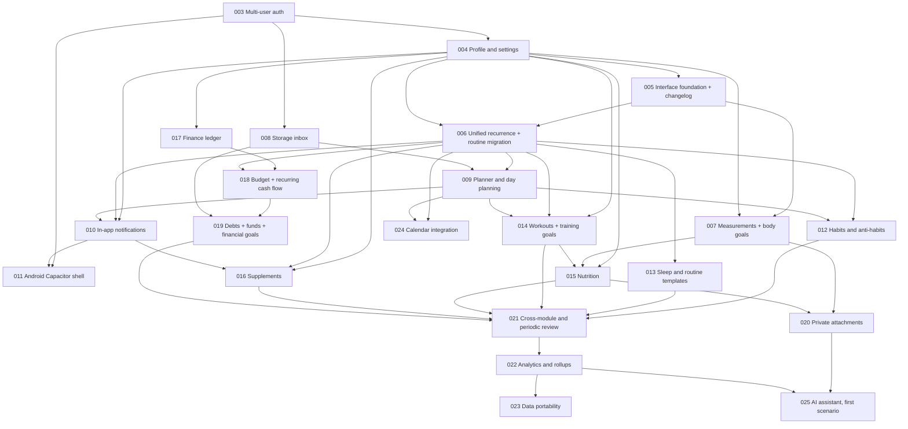

# SelfHandler — Delivery Roadmap

This document defines the recommended order for turning the long-term design into Spec Kit delivery
increments. It is a dependency roadmap, not a replacement for feature specifications. Every item
still requires `$speckit-specify -> $speckit-clarify -> $speckit-plan -> $speckit-tasks ->
$speckit-analyze -> $speckit-implement` before application code changes.

> **Roadmap baseline (2026-08-12):** `001-core-daily-loop`, `003-multi-user-auth`, and
> `004-profile-settings` are complete.
> `002-homelab-deployment` stops at T055 by product decision: the current homelab deployment is
> accepted, and T056-T059 are intentionally excluded from the product queue.
>
> **Renumbering (2026-08-12):** the interface foundation and the user-facing changelog were pulled
> forward as feature `005` because every later feature adds forms and every later feature needs a
> place to announce itself. Everything that previously carried a provisional number from `005` to
> `024` moved up by one to `006`-`025`; the Android Capacitor shell moved from `010` to `011`. The
> numbers below are the only valid ones — the pre-renumbering identifiers are retired.

## How to Use This Roadmap

- Feature numbers and slugs below are provisional until the corresponding Spec Kit directory exists.
- The order encodes both hard dependencies and a recommended product sequence. A later item may move
  earlier only when its hard prerequisites are complete and this document is updated with the reason.
- Cross-cutting mechanisms are designed before their consumers, but implemented only with a real
  consumer. Do not build an unused framework.
- Each increment must remain a thin, independently usable vertical slice across persistence, API,
  web UI, ownership checks, contracts, and tests.
- Live user data already exists. Schema evolution is additive and forward-safe by default; destructive
  replacement requires an explicit migration, preservation, and rollback plan.

## Current Baseline

The application already provides:

- invite-only multi-user session authentication and strict per-user ownership;
- routine create/edit/lifecycle behavior with weekday/date scheduling and completion logs;
- a Today checklist with seven-day progress and streaks;
- goals linked to routines;
- one daily review per user and date;
- a working private homelab deployment.
- a private per-user profile with regional preferences, canonical anthropometrics, and user-local
  Today/progress calendar boundaries.

The current routine schedule is a successful product slice, but it is not the shared recurrence model
described in [recurrence-engine.md](recurrence-engine.md). No second scheduling implementation may be
added before that boundary is resolved.

## Dependency Map

## Ordered Spec Kit Queue

### 004 — Profile and Settings Foundation

**Status:** Complete on 2026-08-12 (`34/34` tasks; deployment was not part of this feature).

**User outcome:** each account owns the inputs the rest of the application relies on.

Include per-user time zone, locale, display units, base currency, recommendation tone, BMR formula,
and baseline anthropometrics. Replace the application-wide SelfHandler timezone fallback at user-facing
boundaries while keeping server and database storage in UTC.

**Why first:** recurrence expansion, reminders, measurements, nutrition, workouts, and finance all
depend on these inputs. They must not invent local copies.

**Explicitly defer:** measurement history, recommendations, currency conversion, and notification
delivery.

### 005 — Interface Foundation and User Changelog

**Status:** Complete on 2026-08-12 (`46/46` tasks).

**User outcome:** every form in the application looks and behaves like one product, and the user can
see what changed and how to try it.

Replace the remaining default browser `select`, date, time, and checkbox controls with a small set of
owned Vue components (field wrapper, text/number/textarea inputs, listbox select, searchable
combobox, calendar date picker, time field, checkbox, switch, segmented control) that keep the warm
paper visual language and satisfy keyboard, screen-reader, touch, and reduced-motion requirements.
Add an authenticated `/changelog` route backed by a typed static content module, and rework the
primary navigation so additional destinations still fit a 390px viewport.

**Why here:** features 006 and 007 both introduce non-trivial forms (recurrence editing, dated
measurements). Building those on native controls would either ship inconsistent UI or force a second
migration later. The changelog is what makes each following increment visible to the owner.

**Prerequisites:** 004 supplies the locale and time zone the date and time controls format against.

**Explicitly defer:** a general design-system package, theming, animation frameworks, a
backend-served or CMS-backed changelog, and any component without a current consumer.

### 006 — Unified Recurrence with Routine Migration

**User outcome:** routines keep their current behavior while gaining a reusable, occurrence-based
schedule that future modules can share.

Introduce `RecurringRule` and `PlannedOccurrence`, deterministic time-zone-aware materialization,
idempotency, rule-edit behavior, and occurrence state transitions. Use routines as the first real
consumer. Preserve existing routine history and API behavior through an explicit migration or adapter;
do not leave `routine_weekdays` and the shared engine as two competing sources of truth.

**Why now:** Planner, habits, supplements, workouts, and recurring finance would otherwise create
incompatible schedules.

**Prerequisites:** 004 for the user time zone and 005 for the shared form controls the recurrence
editor is built from.

**Explicitly defer:** reminders, domain-specific payload behavior, external calendar RRULE sync, and
complex RRULE fallback unless a routine acceptance scenario needs it.

### 007 — Body Measurements and Body Goals

**User outcome:** the user records dated body measurements and follows measurable body-composition
goals.

Add the measurement log, extensible metrics in canonical base units, body-goal details, milestones,
safe pace validation, and deterministic trends needed by later Nutrition and Analytics features.

**Prerequisites:** 004 and 005. Recurring measurement reminders wait for 010; photos wait for 020.

### 008 — Storage Inbox and Quick Capture

**User outcome:** tasks and ideas can be captured quickly, triaged, grouped into projects, and broken
into blocking child items.

Start the shared `Item` base with task and idea flows, projects, parent/child blockers, priority, and
Storage-local tags. Make this the owner of the app-wide inbox and quick-capture entry point.

**Why before Planner:** Planner schedules or displays tasks; it must not create a second task model.

**Explicitly defer:** purchase completion, finance links, advanced list-item schemas, and global tag
extraction. Add those only when their next real consumer exists.

### 009 — Planner and Day Planning

**User outcome:** the user plans a day using manual time blocks, recurring occurrences, routines, and
dated Storage tasks in one place.

Define one read/interaction boundary for schedulable sources instead of copying records into Planner.
Support a selected day, reschedule-vs-skip behavior, and a Tomorrow planning surface that extends the
existing Today experience.

**Prerequisites:** 006 and 008.

**Explicitly defer:** reminder delivery and external calendar synchronization.

### 010 — In-App Notifications

**User outcome:** the user receives reliable in-app reminders with per-user quiet hours, snooze, and
a digest without duplicating domain state.

Use `PlannedOccurrence` and selected non-recurring sources as notification sources. Implement the
channel contract with in-app delivery first, idempotent jobs, settings, and automatic closing when the
owning fact is completed.

**Prerequisites:** 004, 006, and 009.

**Explicitly defer:** FCM, email, Telegram, and generalized delivery auditing until a concrete channel
feature needs them.

### 011 — Android Capacitor Shell

**User outcome:** the user installs a sideloadable Android APK, signs in safely, and uses the shared
SelfHandler interface and homelab data on a real phone.

Create the Capacitor Android shell from the existing production web build, define environment-specific
API connectivity, and resolve mobile authentication explicitly: the browser's current same-origin
session assumptions cannot be copied unchanged into the app origin. Preserve the existing browser
security contract, keep mobile credentials out of Web Storage, and verify login/logout/session expiry,
Android back navigation, keyboard/viewport behavior, icons/splash, and debug/release APK builds. Add
the first Capacitor local-notification adapter to the notification contract from 010 when its acceptance
journey is included.

**Prerequisites:** 003 and 010. The shared web flows remain the product source; Android-specific code
is limited to the shell, secure platform boundaries, and native plugins.

**Explicitly defer:** offline data synchronization, Play Store publication, camera/gallery access,
FCM, and iOS. Camera/gallery arrives with 020; other native capabilities require their own increments.

### 012 — Habits and Anti-Habits

**User outcome:** the user builds habits, records numeric or yes/no completion, tracks abstinence or a
stepped limit, and sees deterministic streaks.

Reuse recurrence and Planner. Link habit stacking to existing routines without turning a habit and a
routine into the same entity. Keep anti-habit stepped limits distinct from goal milestones.

**Prerequisites:** 006, 009, and the existing routine/goal baseline. Use 010 only for reminder stories.

### 013 — Sleep and Rich Routine Templates

**User outcome:** the user plans and records sleep and uses ordered morning/evening routine templates
with independently completable activities.

Extend Module 1 without replacing the occurrence source introduced in 006. Feed sleep and routine
aggregates into Today/Review through module-owned summaries.

**Prerequisites:** 004 and 006. Use 009 for day placement and 010 for reminder stories.

### 014 — Workouts and Training Goals

**User outcome:** the user logs strength/cardio/running sessions, follows a simple program, and sees
progress toward a training goal.

Adopt class-table modeling for divergent workout details, canonical units, an exercise catalog,
manual facts, deterministic progression, and recurring planned sessions. Add the training goal type
with the module rather than speculating about every future goal type in advance.

**Prerequisites:** 004, 006, and 009.

**Explicitly defer:** wearable imports, GPX, advanced training-plan generation, and LLM coaching.

### 015 — Nutrition, Meals, Hydration, and Targets

**User outcome:** the user logs meals and beverages and sees calorie, macro, hydration, and food-quality
progress against a stable daily target.

Port only the useful product/model evidence from `calorie-tracker`; Laravel/MySQL remains authoritative.
Compute targets from Profile, body goals, and planned workout activity. The target used during the day
must not drift when actual activity changes; end-of-day refinement is a separate calculation.

**Prerequisites:** 004, 007, and 014.

**Explicitly defer:** photo recognition and receipt-like vision flows until 020 and 025.

### 016 — Supplements, Courses, Intake, and Stock

**User outcome:** the user defines a neutral supplement/medication tracker, follows an intake course,
records actual intake, and sees stock/run-out forecasts.

Use shared recurrence for courses and shared notifications for escalation. Stock forecasting remains
owned by Supplements and produces a one-off restock proposal; it is not a recurring rule.

**Prerequisites:** 004, 006, and 010.

**Explicitly defer:** medical advice, finance transaction creation, and AI regimen generation.

### 017 — Finance Ledger Foundation

**User outcome:** the user manages multi-currency accounts, categories, income/expenses, and transfers
with trustworthy balances.

Introduce the `Money` value object with `DECIMAL(19,4)`, currencies, historical exchange rates,
accounts, two-level categories, paired transfer transactions, archival, and reconciliation. Base
currency comes only from Profile.

**Prerequisites:** 004.

**Explicitly defer:** budgets, recurring operations, debts, saving funds, and investments.

### 018 — Budget and Recurring Cash Flow

**User outcome:** the user compares monthly budget limits with actual spending and sees planned income,
mandatory expenses, and free cash flow.

Build on ledger transactions, shared recurrence, and notifications. Planned occurrences must become
actual transactions through an explicit idempotent action rather than by duplicating balances.

**Prerequisites:** 006, 010, and 017.

### 019 — Debts, Saving Funds, Financial Goals, and Purchase Links

**User outcome:** the user tracks debts in both directions, saving/emergency funds, linked financial
goals, and purchases that become real expenses or installment debts.

Add the remaining Finance aggregates and enforce the locked cross-module invariants: a financial goal
reads progress from its debt/fund, and a bought Storage purchase has a linked transaction or debt.
Connect Supplement restock proposals without moving stock logic into Finance.

**Prerequisites:** 008, 017, and 018.

### 020 — Private Attachments with First Consumers

**User outcome:** the user privately stores body-progress and meal photos and can retrieve or delete
them safely.

Implement the polymorphic `Attachment` model and `FileStorage` service with user-scoped access, private
streaming/signed access, cleanup semantics, quotas, and at least one real consumer from Measurements
or Nutrition.

**Prerequisites:** 007 or 015 plus the existing ownership boundary.

**Explicitly defer:** image recognition, receipt parsing, and GPX parsing.

### 021 — Cross-Module and Periodic Review

**User outcome:** Daily Review becomes a trustworthy summary of implemented modules, and the user can
complete weekly/monthly reviews without losing the existing evening ritual.

Each source module exposes its own daily/period aggregate; Review composes those values and owns only
review-specific facts and the composite day score. Do not query every module's raw tables from one
controller.

**Prerequisites:** enough real sources to make the review useful: at minimum 012-016, with Finance
included only after 019.

### 022 — Analytics and Long-Period Rollups

**User outcome:** the user compares periods and sees deterministic trends and selected correlations
without slow raw-history scans.

Introduce rollups only for metrics proven by implemented module aggregates. Analytics displays and
correlates module-owned values; it does not become the owner of nutrition, workout, habit, or finance
calculations.

**Prerequisites:** 021 and at least two meaningful time-series source modules.

### 023 — Data Portability and Reports

**User outcome:** the user can export useful CSV/PDF reports and a complete machine-readable backup,
then verify that supported data can be restored without crossing ownership boundaries.

Version the export schema and separate human reports from backup/restore. Include attachments by
manifest rather than embedding unbounded blobs into JSON.

**Prerequisites:** 022 for consolidated reports and stable domain contracts for full backup/restore.

### 024 — Calendar Integration

**User outcome:** the user optionally synchronizes Planner/occurrence events with a calendar while
keeping local domain facts authoritative.

Introduce the shared `Integration` and `SyncedItem` boundary with encrypted tokens, calendars as the
first adapter, explicit conflict behavior, and privacy filters for sensitive event types.

**Prerequisites:** 006 and 009. This item may move earlier for product priority after those two are
stable, but it must not precede them.

**Explicitly defer:** Strava/Garmin/Apple Health and bank adapters until their owning local modules are
stable and a separate feature specifies them.

### 025 — AI Assistant Foundation with One Confirmed Scenario

**User outcome:** the user configures a BYOK provider and uses one useful AI-assisted flow while the
application remains fully functional without it.

Implement encrypted provider credentials, masked settings, provider testing, consent, structured
output validation, tool-call authorization, and confirm-before-write. Select one scenario backed by a
stable deterministic module; do not expose a universal agent over unfinished domains.

**Prerequisites:** stable domain APIs for the chosen scenario. Vision scenarios additionally require
020; cross-domain insights require 022.

## Architecture Gates for Every Feature

Before `tasks.md` is accepted, the feature plan must answer:

1. **Owner:** which module owns each new fact, state transition, and aggregate?
2. **Inputs:** does the feature read shared inputs from Profile rather than copy them?
3. **Time:** are persisted instants UTC and calendar dates/time-zone expansion handled explicitly?
4. **Scheduling:** does recurring behavior use `RecurringRule`/`PlannedOccurrence` rather than a local
   schedule table or status copy?
5. **Cross-module links:** is there one authoritative direction and an idempotent invariant?
6. **Evolution:** how are live rows migrated additively, verified, and rolled back?
7. **Contracts:** which backend tests, OpenAPI shapes, frontend types, and consumers change together?
8. **Aggregates:** does the owning module compute totals, with Analytics/Review consuming rather than
   recomputing them?
9. **Privacy:** are ownership, private files, tokens, and external-data exposure bounded explicitly?
10. **Deferral:** which tempting adjacent mechanisms remain out of scope, and what event should trigger
    their extraction?

An unresolved answer is a `clarify` item. A feature that needs an unfinished hard prerequisite must be
split, delayed, or accompanied by the smallest real prerequisite slice; it must not create a temporary
parallel architecture.

## Demand-Driven Follow-Ups

The following are deliberately not assigned fixed positions yet:

- global tags or templates: extract only after two implemented modules need compatible behavior;
- push/email/Telegram channels: add one adapter per concrete delivery need after 010;
- Strava/Garmin/Apple Health and bank import: add after the corresponding local source of truth is
  stable;
- receipt/meal/body-photo vision and other AI scenarios: add after 020 and 025;
- investments, advanced amortization, collaboration/roles, recovery/2FA, advanced offline behavior,
  Play Store publication, and iOS: each requires its own future Spec Kit increment.

This keeps the dependency direction stable without pretending that current product priorities can
fully predict every later adapter or advanced scenario.
