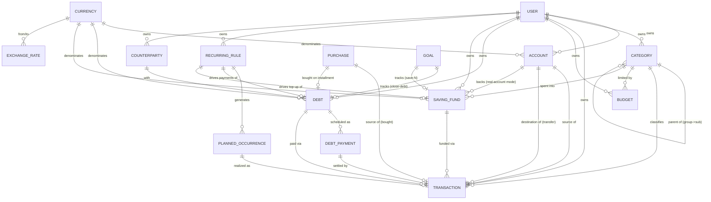

# SelfHandler — Финансы: ER-схема

> Концептуальная ER-схема Модуля 10 (Финансы). Логические сущности и связи — мостик к реализации на Laravel/MySQL. Не финальный DDL: конкретные типы/индексы/nullable уточняются при создании миграций (открытые вопросы — внизу и в [Modules Spec](modules.md)).
>
> Спека: [Modules Spec](modules.md) · Решения: [Decisions Log](decisions.md)

---

## Диаграмма

> ⚠️ Mermaid ER не рисует две связи между одной парой сущностей с разными ролями идеально (ACCOUNT↔TRANSACTION источник/получатель, CURRENCY↔EXCHANGE_RATE from/to) — в реальной схеме это два FK на одну таблицу. Текстовая расшифровка ниже — источник истины.

---

## Сущности (логически)

### Ядро денег
- **USER** — владелец всего (single-user сейчас, поле user_id заложено под multi-user). Хранит **базовую валюту**.
- **CURRENCY** — справочник валют (грн/USD/EUR…). Код валюты.
- **EXCHANGE_RATE** — курс: валюта_from + валюта_to + **дата** + курс. Исторический (на дату операции), не только текущий.
- **ACCOUNT** — счёт: название, тип (наличка/карта/накопительный/валютный), **валюта** (одна), флаг архивный. Баланс — производная (не колонка, а агрегат), либо денормализованный кэш.
- **CATEGORY** — категория: название, направление (доход/расход), **parent_id** (самоссылка: группа → подкатегория, 2 уровня), флаг архивная. Пример: Медицина → Стоматология.
- **TRANSACTION** — транзакция: тип (доход/расход/перевод), сумма+валюта, счёт-источник, счёт-получатель (только перевод), категория (доход/расход), дата, заметка, тег. Для валютного перевода — обе суммы + эффективный курс. Опц. ссылки: на DEBT (платёж по долгу), на SAVING_FUND (пополнение).
  - **`source` — полиморфная ссылка на источник** (`source_type` + `source_id`): добавка (Модуль 2а, докупка) / **покупка-item (Модуль 7)** / null. Это точка связи Хранилище↔Финансы и Добавки↔Финансы. FK живёт здесь (на стороне денег), доменные сущности о деньгах не знают.
- **PURCHASE (item, Модуль 7)** — внешняя сущность Хранилища (не таблица Финансов), показана для полноты связи. Покупка из wish-листа. Инвариант: статус «куплено» ⟺ существует TRANSACTION с `source` = эта покупка (или связанный DEBT-рассрочка).

### Бюджет
- **BUDGET** — лимит: категория + период (месяц/год) + сумма лимита. Факт считается агрегатом транзакций категории за период (не хранится).

### Долги
- **COUNTERPARTY** — контрагент (банк/магазин/человек). ⚠️ open: отдельная сущность vs свободный текст в DEBT.
- **DEBT** — долг: направление (я должен / мне должны), контрагент, исходная сумма + остаток, валюта, режим графика (фиксированный / свободный), опц. проценты/переплата, дедлайн, статус, опц. счёт списания.
- **DEBT_PAYMENT** — запланированный платёж графика (только для фикс-режима): дата, сумма, статус (запланирован/оплачен/просрочен). Факт оплаты = ссылка на TRANSACTION.

### Накопления
- **SAVING_FUND** — копилка/подушка (единая сущность с флагами): название, целевая сумма + накоплено, валюта, опц. категория и срок, режим хранения (виртуальный конверт / привязка к ACCOUNT), статус.
  - Флаги **подушки безопасности**: `is_emergency` (обязательная) + `is_perpetual` (бессрочная) + правило пополнения (фикс-сумма / % от дохода / N месяцев расходов).
  - ⚠️ open: единая сущность с флагами vs отдельные таблицы FUND/EMERGENCY_FUND.

### Регулярность (СКВОЗНОЙ движок — НЕ локальный для Финансов)
> ⚠️ `RECURRING_RULE` / `PLANNED_OCCURRENCE` здесь — это **тот же сквозной механизм**, что канонически определён в [Modules Spec](modules.md). Финансы — лишь один из 6+ потребителей (добавки/тренировки/замеры/задачи/привычки/финансы). Не дублировать таблицу под Финансы — она общая, с полиморфной привязкой к владельцу.
- **RECURRING_RULE** — повторяющееся правило (RRULE/RFC 5545 рекомендован): паттерн, dtstart, until/count, timezone, полиморфный владелец. Для Финансов владелец = фин-операция / долг / копилка-подушка; несёт направление (доход/расход), сумму, валюту, счёт, категорию.
- **PLANNED_OCCURRENCE** — запланированный экземпляр из правила: плановая дата + сумма + статус (план/получено/оплачено/пропущено/перенесено). Факт = ссылка на TRANSACTION. Идемпотентность: уникальный `(rule_id, occurrence_date)`.

### Цели (из Модуля 4, не дублируется тут)
- **GOAL** (тип «Финансы») — обёртка со сроком/майлстоунами: «накопить N» → tracks SAVING_FUND; «закрыть кредит» → tracks DEBT. Прогресс берётся из связанной сущности.

---

## Ключевые связи и инварианты

| Связь | Кардинальность | Смысл |
|-------|----------------|-------|
| ACCOUNT → TRANSACTION | 1 : N (×2 роли) | source_account_id (всегда) + dest_account_id (только перевод) |
| CATEGORY → CATEGORY | 1 : N (self) | parent_id; глубина ровно 2 (группа/подкатегория) |
| CATEGORY → TRANSACTION | 1 : N | только доход/расход; перевод без категории |
| BUDGET → CATEGORY | N : 1 | лимит на категорию/период; факт = агрегат |
| DEBT → DEBT_PAYMENT | 1 : N | только фикс-график; свободный режим — без строк графика |
| DEBT_PAYMENT → TRANSACTION | 1 : 0..1 | плановый платёж закрывается фактической транзакцией |
| SAVING_FUND → ACCOUNT | N : 0..1 | только режим «реальный счёт»; виртуальный — без FK, сумма в самой копилке |
| RECURRING_RULE → PLANNED_OCCURRENCE | 1 : N | правило разворачивается в плановые операции |
| PLANNED_OCCURRENCE → TRANSACTION | 1 : 0..1 | план реализуется фактом |
| GOAL → DEBT / SAVING_FUND | 1 : 0..1 | цель «закрыть кредит» / «накопить N» |
| PURCHASE → TRANSACTION (source) | 1 : 0..1 | полиморфный `TRANSACTION.source`; FK на стороне транзакции |
| PURCHASE → DEBT | 1 : 0..1 | покупка в рассрочку → долг (направление FK: debt.purchase_id) |

**Инварианты:**
- Перевод: source_account и dest_account обязаны различаться; категория null; для разных валют хранятся обе суммы.
- Транзакция-перевод не считается доходом и не расходом (не попадает в бюджет/cash flow как доход/расход).
- Баланс счёта = стартовый + Σ(зачисления) − Σ(списания); не редактируется напрямую.
- Остаток долга = исходная сумма − Σ(платежей по долгу).
- Cash flow месяца = Σ(плановые доходы) − Σ(обязательные расходы: регулярные расходы + DEBT_PAYMENT месяца + обязательное пополнение подушки).
- **Покупка «куплено» ⟺ существует TRANSACTION с source = эта покупка (или связанный DEBT-рассрочка).** Отмена транзакции → покупка возвращается в «хочу».
- Прогресс фин-цели «накопить N» = накоплено в связанной SAVING_FUND (не баланс счёта напрямую — копилка может быть виртуальной).

---

## Открытые вопросы схемы (решить при миграциях)

> Часть закрыта ревью-проходом 2026-06-13 (есть рекомендация). Открытые — без галочки.

1. **Стартовый баланс счёта:** колонка `opening_balance` vs первая корректирующая TRANSACTION. ⬜ открыт.
2. ✅ **Перевод → две связанные записи** (transfer_out + transfer_in, `transfer_group_id`). Чище для баланса каждого счёта и для разных валют (каждая нога в своей валюте). (рекомендация ревью)
3. **Копилка ↔ подушка:** единая SAVING_FUND с флагами vs отдельные таблицы. ⬜ открыт (склоняемся к единой с флагами).
4. **Виртуальный конверт:** ✅ решение — **«свободный баланс» = баланс счёта − Σ конвертов на нём**, конверт НЕ двигает деньги физически. Инвариант: Σ конвертов ≤ баланс. Это вычисляемая величина, не отдельные деньги.
5. **Контрагент:** COUNTERPARTY как сущность vs строка в DEBT. ⬜ открыт (рекомендация — сущность сразу, дешевле дедупа потом).
6. ✅ **Базовая валюта → в профиле/настройках пользователя** (Модуль 0), не в настройках Финансов. Закрыто принципом «Профиль — источник входов».
7. ✅ **RECURRING_RULE → RRULE (RFC 5545)** через готовую либу. Сквозной формат, см. [Modules Spec](modules.md).
8. ✅ **PLANNED_OCCURRENCE → материализация с окном вперёд** (+90 дней) + уникальный `(rule_id, occurrence_date)` для идемпотентности. (рекомендация ревью)
9. ✅ **Деньги → DECIMAL(19,4)** (или минорные единицы BIGINT) + value object `Money` (amount+currency). Глобально, не float. Сводный пересчёт валют — **в момент чтения** по выбранному курсу (текущий для «сейчас», исторический для «тогда»), не хранить пересчитанное.
10. **Покупка↔транзакция (Модуль 7):** ✅ полиморфный `TRANSACTION.source` + инвариант «куплено ⟺ есть транзакция». FK на стороне транзакции.
11. ✅ **Полиморфизм по типу (сквозной)** → гибрид: class-table для разнополевых (Тренировки), single-table+nullable/JSON для близких (Цели/Хранилище/Долги). Без STI-магии. Зафиксировано в [Data Conventions](data-conventions.md).
12. ✅ **Агрегаты** → кэш-значение + event-пересчёт (Observer) для горячих производных + daily-rollup для аналитики. См. [Data Conventions](data-conventions.md).

> Money (#9), перевод (#2), конверт (#4), валюты, user_id, удаление/архив, таймзоны — сведены в [Data Conventions](data-conventions.md).
