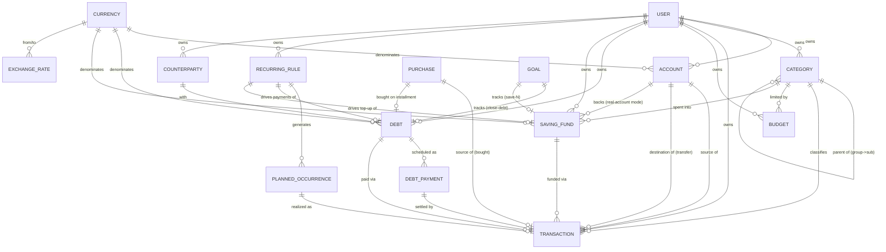

# SelfHandler — Finance: ER Diagram

> Conceptual ER diagram for Module 10 (Finance). Logical entities and relationships — a bridge toward the Laravel/MySQL implementation. Not the final DDL: concrete types/indexes/nullability are pinned down when the migrations are written (open questions — at the bottom and in the [Modules Spec](modules.md)).
>
> Spec: [Modules Spec](modules.md) · Decisions: [Decisions Log](decisions.md)

---

## Diagram

> ⚠️ Mermaid ER doesn't render two relationships between the same pair of entities with different roles cleanly (ACCOUNT↔TRANSACTION source/destination, CURRENCY↔EXCHANGE_RATE from/to) — in the real schema these are two FKs on a single table. The textual breakdown below is the source of truth.

---

## Entities (logical)

### Money core
- **USER** — the owner of everything (single-user for now, the user_id field is in place for multi-user). Stores the **base currency**.
- **CURRENCY** — currency reference table (UAH/USD/EUR…). Currency code.
- **EXCHANGE_RATE** — exchange rate: currency_from + currency_to + **date** + rate. Historical (as of the operation date), not just the current one.
- **ACCOUNT** — account: name, type (cash/card/savings/foreign-currency), **currency** (single), archived flag. The balance is a derived value (not a column but an aggregate), or a denormalized cache.
- **CATEGORY** — category: name, direction (income/expense), **parent_id** (self-reference: group → subcategory, 2 levels), archived flag. Example: Medical → Dentistry.
- **TRANSACTION** — transaction: type (income/expense/transfer), amount+currency, source account, destination account (transfer only), category (income/expense), date, note, tag. For a cross-currency transfer — both amounts + the effective exchange rate. Optional references: to DEBT (debt payment), to SAVING_FUND (top-up).
  - **`source` — polymorphic reference to the origin** (`source_type` + `source_id`): supplement (Module 2a, restock) / **purchase item (Module 7)** / null. This is the connection point between Storage↔Finance and Supplements↔Finance. The FK lives here (on the money side); the domain entities know nothing about money.
- **PURCHASE (item, Module 7)** — an external Storage entity (not a Finance table), shown here for completeness of the relationship. A purchase from the wish list. Invariant: status "bought" ⟺ a TRANSACTION exists with `source` = this purchase (or a linked installment DEBT).

### Budget
- **BUDGET** — limit: category + period (month/year) + limit amount. The actual is computed as an aggregate of the category's transactions over the period (not stored).

### Debts
- **COUNTERPARTY** — counterparty (bank/store/person). ⚠️ open: a separate entity vs free text in DEBT.
- **DEBT** — debt: direction (I owe / owed to me), counterparty, original amount + remaining, currency, schedule mode (fixed / flexible), optional interest/overpayment, deadline, status, optional charge account.
- **DEBT_PAYMENT** — a scheduled payment in the schedule (fixed mode only): date, amount, status (scheduled/paid/overdue). The fact of payment = a reference to a TRANSACTION.

### Savings
- **SAVING_FUND** — saving fund / emergency fund (a single entity with flags): name, target amount + accumulated, currency, optional category and term, storage mode (virtual envelope / linked to an ACCOUNT), status.
  - **Emergency Fund** flags: `is_emergency` (mandatory) + `is_perpetual` (open-ended) + a top-up rule (fixed amount / % of income / N months of expenses).
  - ⚠️ open: a single entity with flags vs separate FUND/EMERGENCY_FUND tables.

### Recurrence (CROSS-CUTTING engine — NOT local to Finance)
> ⚠️ `RECURRING_RULE` / `PLANNED_OCCURRENCE` here are **the same cross-cutting mechanism** canonically defined in the [Modules Spec](modules.md). Finance is just one of 6+ consumers (supplements/workouts/measurements/tasks/habits/finance). Don't duplicate the table for Finance — it's shared, with a polymorphic binding to the owner.
- **RECURRING_RULE** — a recurring rule (RRULE/RFC 5545 recommended): pattern, dtstart, until/count, timezone, polymorphic owner. For Finance the owner = a financial operation / debt / emergency saving fund; carries direction (income/expense), amount, currency, account, category.
- **PLANNED_OCCURRENCE** — a planned instance generated from a rule: planned date + amount + status (planned/received/paid/skipped/rescheduled). The fact = a reference to a TRANSACTION. Idempotency: a unique `(rule_id, occurrence_date)`.

### Goals (from Module 4, not duplicated here)
- **GOAL** (type "Finance") — a wrapper with a term/milestones: "save N" → tracks SAVING_FUND; "close a loan" → tracks DEBT. Progress is taken from the linked entity.

---

## Key relationships and invariants

| Relationship | Cardinality | Meaning |
|-------|----------------|-------|
| ACCOUNT → TRANSACTION | 1 : N (×2 roles) | source_account_id (always) + dest_account_id (transfer only) |
| CATEGORY → CATEGORY | 1 : N (self) | parent_id; depth is exactly 2 (group/subcategory) |
| CATEGORY → TRANSACTION | 1 : N | income/expense only; a transfer has no category |
| BUDGET → CATEGORY | N : 1 | a limit per category/period; the actual = an aggregate |
| DEBT → DEBT_PAYMENT | 1 : N | fixed schedule only; flexible mode has no schedule rows |
| DEBT_PAYMENT → TRANSACTION | 1 : 0..1 | a scheduled payment is settled by an actual transaction |
| SAVING_FUND → ACCOUNT | N : 0..1 | "real account" mode only; virtual has no FK, the amount lives in the saving fund itself |
| RECURRING_RULE → PLANNED_OCCURRENCE | 1 : N | a rule expands into planned operations |
| PLANNED_OCCURRENCE → TRANSACTION | 1 : 0..1 | a plan is realized by an actual |
| GOAL → DEBT / SAVING_FUND | 1 : 0..1 | a "close a loan" / "save N" goal |
| PURCHASE → TRANSACTION (source) | 1 : 0..1 | polymorphic `TRANSACTION.source`; FK on the transaction side |
| PURCHASE → DEBT | 1 : 0..1 | an installment purchase → a debt (FK direction: debt.purchase_id) |

**Invariants:**
- Transfer: source_account and dest_account must differ; category is null; for differing currencies both amounts are stored.
- A transfer transaction counts as neither income nor expense (it doesn't enter the budget/cash flow as income or expense).
- Account balance = opening + Σ(credits) − Σ(debits); not edited directly.
- Debt remaining = original amount − Σ(debt payments).
- Monthly cash flow = Σ(planned income) − Σ(mandatory expenses: recurring expenses + this month's DEBT_PAYMENT + the mandatory emergency fund top-up).
- **A purchase is "bought" ⟺ a TRANSACTION exists with source = this purchase (or a linked installment DEBT).** Reverting the transaction → the purchase returns to "want".
- Progress of a "save N" financial goal = the amount accumulated in the linked SAVING_FUND (not the account balance directly — the fund may be virtual).

---

## Open schema questions (to resolve during migrations)

> Some were closed by the review pass on 2026-06-13 (a recommendation is given). Open ones — without a checkmark.

1. **Account opening balance:** an `opening_balance` column vs the first adjusting TRANSACTION. ⬜ open.
2. ✅ **Transfer → two linked records** (transfer_out + transfer_in, `transfer_group_id`). Cleaner for each account's balance and for differing currencies (each leg in its own currency). (review recommendation)
3. **Saving fund ↔ emergency fund:** a single SAVING_FUND with flags vs separate tables. ⬜ open (leaning toward a single one with flags).
4. **Virtual envelope:** ✅ decision — **"available balance" = account balance − Σ envelopes on it**, the envelope does NOT move money physically. Invariant: Σ envelopes ≤ balance. It's a computed value, not separate money.
5. **Counterparty:** COUNTERPARTY as an entity vs a string in DEBT. ⬜ open (recommendation — an entity from the start, cheaper than deduping later).
6. ✅ **Base currency → in the user's profile/settings** (Module 0), not in the Finance settings. Closed by the "Profile is the source of inputs" principle.
7. ✅ **RECURRING_RULE → RRULE (RFC 5545)** via an off-the-shelf library. A cross-cutting format, see the [Modules Spec](modules.md).
8. ✅ **PLANNED_OCCURRENCE → materialization with a look-ahead window** (+90 days) + a unique `(rule_id, occurrence_date)` for idempotency. (review recommendation)
9. ✅ **Money → DECIMAL(19,4)** (or minor units as BIGINT) + a `Money` value object (amount+currency). Globally, not float. Roll-up currency conversion happens **at read time** using the chosen rate (the current one for "now", the historical one for "back then"); don't store the converted value.
10. **Purchase ↔ transaction (Module 7):** ✅ polymorphic `TRANSACTION.source` + the "bought ⟺ a transaction exists" invariant. FK on the transaction side.
11. ✅ **Polymorphism by type (cross-cutting)** → a hybrid: class-table for entities with divergent fields (Workouts), single-table + nullable/JSON for similar ones (Goals/Storage/Debts). No STI magic. Pinned down in [Data Conventions](data-conventions.md).
12. ✅ **Aggregates** → a cached value + event-driven recompute (Observer) for hot derived values + a daily rollup for analytics. See [Data Conventions](data-conventions.md).

> Money (#9), transfer (#2), envelope (#4), currencies, user_id, deletion/archival, time zones — consolidated in [Data Conventions](data-conventions.md).
