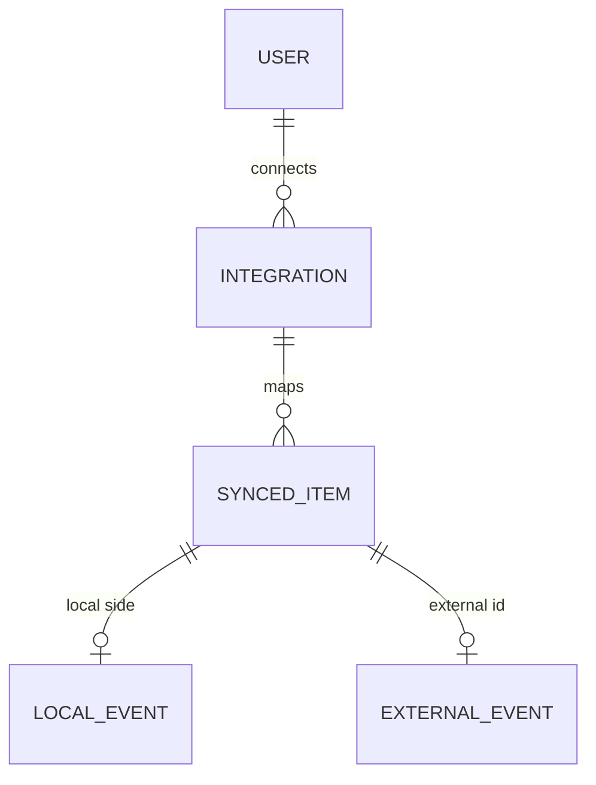

# SelfHandler — External Integrations

> Cross-cutting mechanism for connecting external services via OAuth/tokens plus data synchronization. A single contract with per-provider adapters. The first member is **calendars (Google/Apple)**; Strava/Garmin/Apple Health (running) and bank statements (finances) will fit into the same layer.
>
> Related: [Recurrence Engine](recurrence-engine.md) · [Modules Spec](modules.md) · [Modules Spec](modules.md) · decisions: [Decisions Log](decisions.md)

---

## Why a single mechanism, not one-off implementations

| Provider | Domain | Direction | When |
|----------|--------|-----------|------|
| **Google Calendar** | events | two-way | now (first) |
| **Apple Calendar** | events | two-way | now (first) |
| Strava / Garmin | running/workouts | import | later |
| Apple Health | activity/heart rate | import | later |
| Bank statement (CSV/API) | transactions | import | later |

All of them are "an external source with OAuth/token + synchronization." **Same pattern as BYOK-LLM (M11) and Notification channels:** a single contract with adapters. Don't build calendars as a one-off, otherwise Strava/banks would have to be rewritten from scratch.

---

## Decisions (locked in on 2026-06-13)

- **Shared integration layer** — calendars are the first member, the contract is reusable.
- **Two-way calendar sync:** SelfHandler events → external calendar AND external events → into the Planner (to see the full day's busy slots).
- A connection is a **user choice** (optional, see [Modules Spec](modules.md)): app calendar only / app + external.

---

## The `Integration` entity (connection)

- `id`, `user_id`
- `provider` (google_calendar / apple_calendar / strava / …)
- `kind` (calendar / fitness / bank — domain type)
- **OAuth data:** access_token, refresh_token, expires_at — **encrypted in the DB** (like BYOK keys, [Modules Spec](modules.md)); never exposed to the frontend in plaintext
- `external_account` (which account/calendar is connected), optionally selecting a specific calendar
- `status` (active / expired / revoked), `last_sync_at`
- `settings` (JSON): sync direction, which event types to sync, conflict policy

## The `SyncedItem` entity (local ↔ external mapping)

- Links a local record (event/occurrence) to an external ID: `integration_id`, a polymorphic local reference, `external_id`, `etag`/`updated_at` from both sides
- Required for **deduplication and conflict resolution** (avoid creating duplicates, determine what changed)

---

## Provider contract (Strategy/Adapter)

- A single `CalendarProvider` interface (and the broader `IntegrationProvider`): `authUrl()` / `exchangeCode()` / `refresh()` / `pull(since)` / `push(event)` / `delete(externalId)`
- Implementations: `GoogleCalendarProvider`, `AppleCalendarProvider` (CalDAV) — different APIs, one contract
- Provider resolution at runtime by `Integration.provider` (factory) — like Notification channels and LLM providers

---

## Two-way synchronization — mechanics

### Export (SelfHandler → external)
- What we publish: events from the Planner and `PlannedOccurrence` ([Recurrence Engine](recurrence-engine.md)) — workouts, payments, measurements, deadlines (the user chooses what to sync)
- Recurring rules → native RRULE of the external calendar (if supported) OR expanded instances

### Import (external → SelfHandler)
- External events (meetings, birthdays) → into the Planner as "external busy slots" (not domain data, tagged with their source)
- They don't trigger domain logic — they only provide visibility into the day's busy slots (the day's time cash flow)

### Source of truth and conflicts
- **Per-event source of truth:** created in SelfHandler — ours; imported from outside — external. `SyncedItem` records the owner
- **Conflict** (changed on both sides between syncs): the strategy comes from `settings` — last-write-wins by `updated_at` OR manual resolution. At launch — keep it simple (last-write-wins), flag as open
- Deletion on one side → delete/unlink on the other (per policy)

### How the sync works technically
- A periodic job (Laravel Scheduler + queue): `pull` changes since `last_sync_at`, `push` local ones. Incrementally (by etag/updated_at)
- Webhook/push notifications from Google (where available) — later; polling at launch

---

## Responsibility boundaries

| Mechanism | Responsible for |
|-----------|-----------------|
| **Integrations (this doc)** | OAuth, tokens, provider contract, sync, mapping, conflicts |
| [Recurrence Engine](recurrence-engine.md) | what/when is scheduled locally (the source for export) |
| [Modules Spec](modules.md) | displaying events (own + imported external) in a unified calendar |
| Owner module | domain data (workout, payment) |

---

## Diagram

---

## Open questions

1. Apple Calendar — via CalDAV (more complex than OAuth) vs. Google only at launch.
2. Conflict strategy: last-write-wins (simple) vs. manual resolution vs. per-provider.
3. RRULE mapping: our engine ([Recurrence Engine](recurrence-engine.md) — its own set of fields) → the external calendar's RRULE. The rule's `rrule` output will come in handy here.
4. Which local event types to export by default (privacy: should "supplement intake" be pushed to a shared Google calendar?).
5. ICS feed (calendar subscription, read-only) as a cheap intermediate export option before full OAuth.
6. OAuth scope — the minimum necessary.
