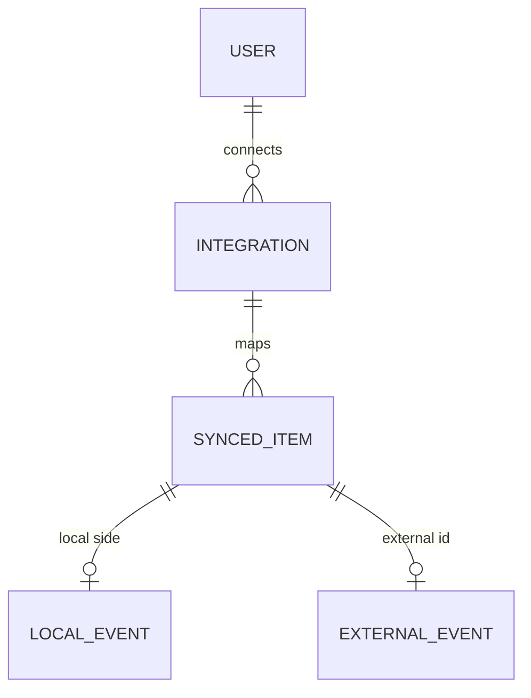

# SelfHandler — Внешние интеграции (Integrations)

> Сквозной механизм подключения внешних сервисов через OAuth/токены + синхронизация данных. Единый контракт + адаптеры под провайдеров. Первый представитель — **календари (Google/Apple)**; сюда же лягут Strava/Garmin/Apple Health (бег) и банк-выписки (финансы).
>
> Связки: [Recurrence Engine](recurrence-engine.md) · [Modules Spec](modules.md) · [Modules Spec](modules.md) · решения: [Decisions Log](decisions.md)

---

## Зачем — единый механизм, не точечно

| Провайдер | Домен | Направление | Когда |
|-----------|-------|-------------|-------|
| **Google Calendar** | события | дву­сторонняя | сейчас (первый) |
| **Apple Calendar** | события | двусторонняя | сейчас (первый) |
| Strava / Garmin | бег/тренировки | импорт | позже |
| Apple Health | активность/пульс | импорт | позже |
| Банк-выписка (CSV/API) | транзакции | импорт | позже |

Все они — «внешний источник с OAuth/токеном + синхронизация». **Паттерн как BYOK-LLM (М11) и каналы Уведомлений:** единый контракт + адаптеры. Не делать календари точечно, иначе Strava/банки переписывать заново.

---

## Решения (зафиксировано 2026-06-13)

- **Общий слой интеграций** — календари первый представитель, контракт переиспользуемый.
- **Двусторонняя синхронизация календарей:** события SelfHandler → внешний календарь И внешние события → в Планнер (видеть занятость дня целиком).
- Подключение — **выбор пользователя** (опционально, см. [Modules Spec](modules.md)): только календарь аппки / аппка + внешний.

---

## Сущность `Integration` (подключение)

- `id`, `user_id`
- `provider` (google_calendar / apple_calendar / strava / …)
- `kind` (calendar / fitness / bank — тип домена)
- **OAuth-данные:** access_token, refresh_token, expires_at — **шифровать в БД** (как BYOK-ключи, [Modules Spec](modules.md)); НЕ отдавать на фронт открыто
- `external_account` (какой аккаунт/календарь подключён), опц. выбор конкретного календаря
- `status` (active / expired / revoked), `last_sync_at`
- `settings` (JSON): направление синка, какие типы событий синкать, конфликт-политика

## Сущность `SyncedItem` (маппинг локальное ↔ внешнее)

- Связь локальной записи (событие/occurrence) с внешним ID: `integration_id`, локальная полиморфная ссылка, `external_id`, `etag`/`updated_at` обеих сторон
- Нужна для **дедупликации и разрешения конфликтов** (не создать дубль, понять что изменилось)

---

## Контракт провайдера (Strategy/Adapter)

- Единый интерфейс `CalendarProvider` (и шире `IntegrationProvider`): `authUrl()` / `exchangeCode()` / `refresh()` / `pull(since)` / `push(event)` / `delete(externalId)`
- Реализации: `GoogleCalendarProvider`, `AppleCalendarProvider` (CalDAV) — разные API, один контракт
- Резолв провайдера в рантайме по `Integration.provider` (фабрика) — как каналы Уведомлений и LLM-провайдеры

---

## Двусторонняя синхронизация — механика

### Экспорт (SelfHandler → внешний)
- Что публикуем: события из Планнера и `PlannedOccurrence` ([Recurrence Engine](recurrence-engine.md)) — тренировки, платежи, замеры, дедлайны (выбор юзера, что синкать)
- Повторяющиеся правила → нативный RRULE внешнего календаря (если поддержан) ИЛИ развёрнутые экземпляры

### Импорт (внешний → SelfHandler)
- Внешние события (встречи, ДР) → в Планнер как «внешние занятые слоты» (не доменные данные, помечены источником)
- Не порождают доменную логику — просто видимость занятости дня (cash flow дня времени)

### Направление истины и конфликты
- **Per-событие источник истины:** созданное в SelfHandler — наше; импортированное извне — внешнее. `SyncedItem` хранит, кто владелец
- **Конфликт** (изменено с обеих сторон между синками): стратегия из `settings` — last-write-wins по `updated_at` ИЛИ ручное разрешение. На старте — простая (last-write-wins), отметить open
- Удаление с одной стороны → удалить/отвязать на другой (по политике)

### Как синкается технически
- Периодическая джоба (Laravel Scheduler+queue): `pull` изменений с `last_sync_at`, `push` локальных. Инкрементально (по etag/updated_at)
- Webhook/push-уведомления от Google (если есть) — позже; на старте поллинг

---

## Границы ответственности

| Механизм | Отвечает за |
|----------|-------------|
| **Integrations (этот док)** | OAuth, токены, контракт провайдера, синк, маппинг, конфликты |
| [Recurrence Engine](recurrence-engine.md) | что/когда запланировано локально (источник для экспорта) |
| [Modules Spec](modules.md) | показ событий (свои + импортированные внешние) в едином календаре |
| Модуль-владелец | доменные данные (тренировка, платёж) |

---

## Диаграмма

---

## Открытые вопросы

1. Apple Calendar — через CalDAV (сложнее OAuth) vs только Google на старте.
2. Конфликт-стратегия: last-write-wins (просто) vs ручное разрешение vs per-провайдер.
3. RRULE-маппинг: наш движок ([Recurrence Engine](recurrence-engine.md) — свой набор полей) → RRULE внешнего календаря. Тут пригодится `rrule`-выход правила.
4. Какие типы локальных событий по умолчанию экспортировать (приватность: выгружать ли «приём добавок» в общий Google-календарь?).
5. ICS-фид (подписка календарём, read-only) как дешёвый промежуточный вариант экспорта до полного OAuth.
6. Объём прав OAuth (scope) — минимально необходимый.
