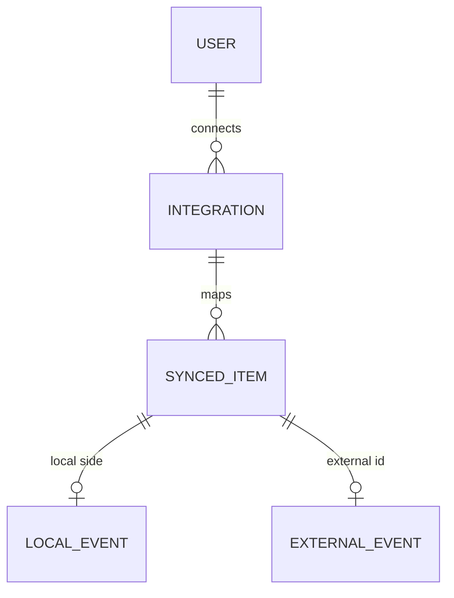

# SelfHandler — External Integrations

> Delivered calendar boundary for connecting external services via OAuth/credentials plus data
> synchronization. One shared provider contract currently has **Google Calendar** and **Apple CalDAV**
> adapters; later fitness and bank providers must arrive through their own feature boundaries.
>
> Related: [Recurrence Engine](recurrence-engine.md) · [Modules Spec](modules.md) · decisions: [Decisions Log](decisions.md)

---

## Why a single mechanism, not one-off implementations

| Provider | Domain | Direction | When |
|----------|--------|-----------|------|
| **Google Calendar** | events | two-way | now (first) |
| **Apple Calendar** | events | two-way | now (first) |
| Strava / Garmin | running/workouts | import | later |
| Apple Health | activity/heart rate | import | later |
| Bank statement (CSV/API) | transactions | import | later |

All of them are "an external source with OAuth/token + synchronization." **Same pattern as BYOK-LLM (M11) and Notification channels:** a single contract with adapters. Don't build calendars as a one-off, otherwise Strava/banks would have to be rewritten from scratch.

---

## Delivery status and decisions

- **Shared integration layer** — calendars are the first member, the contract is reusable.
- **Feature 025 complete on 2026-08-14:** repository-owned API, web, Android shared bundle,
  scheduler, contract, provider-fixture, and browser evidence is green.
- **Two-way calendar sync:** selected SelfHandler projections → one external calendar, and external
  events → read-only Planner busy slots.
- A connection is a **user choice** (optional, see [Modules Spec](modules.md)): app calendar only / app + external.
- **Privacy first:** export starts disabled; busy-only import is the default; imported titles and each
  export category require separate opt-ins.
- **Origin authority:** SelfHandler-origin events are reconciled from local facts. Provider-origin
  events follow provider updates/deletions. There is no launch-wide last-write-wins rule.
- **Disconnect is local-only:** credentials, mappings, and imported cache are removed locally; neither
  provider events nor SelfHandler domain facts are deleted.

---

## The `Integration` entity (connection)

- `id`, `user_id`
- `provider` is closed to `google_calendar` / `apple_calendar` in this boundary; `kind=calendar`
- Google access/refresh tokens or Apple account/app-specific password are **encrypted at rest** and
  never serialized back to clients
- exactly one selected external calendar per user/provider, with encrypted external identifiers
- status (`pending`, `active`, `expired`, `revoked`), last attempt/success/error, encrypted cursor
- settings: `busy_only` plus an explicit export-category allowlist whose default is empty

## The `SyncedItem` entity (local ↔ external mapping)

- Links a local TimeBlock/PlannedOccurrence projection or imported cached event to an encrypted external
  identity, with origin, fingerprint, ETag and bounded timestamps.
- Required for **deduplication and convergence** across retries and provider/database failure boundaries.

---

## Provider contract (Strategy/Adapter)

- One `CalendarProvider` contract covers calendar discovery, bounded pull pages, event upsert and delete;
  Google additionally supplies OAuth authorization/exchange/refresh.
- `GoogleCalendarProvider` uses offline OAuth, paginated incremental sync and a safe full refresh after
  an invalidated cursor.
- `AppleCalendarProvider` uses bounded TLS Basic-auth CalDAV discovery, multistatus parsing,
  sync-collection/calendar-query with ETag fallback, and RFC 5545 parsing/generation through VObject.
- A closed provider registry resolves the adapter; automated tests fake/block all provider traffic.

---

## Two-way synchronization — mechanics

### Export (SelfHandler → external)
- Export is disabled until the user selects categories. Current projections are owned TimeBlocks and
  bounded concrete `PlannedOccurrence` instances; recurring rules are not published as RRULE.
- Sensitive finance and supplement categories are independent opt-ins and are never implied by another
  selection.

### Import (external → SelfHandler)
- Timed and all-day external events → Integration-owned Planner `external_calendar` entries inside the
  Profile-local rolling window (not domain data, tagged with their source).
- They don't trigger domain logic — they only provide visibility into the day's busy slots (the day's time cash flow)

### Source of truth and conflicts
- **Per-event source of truth:** created in SelfHandler — local; imported from outside — provider.
  `SyncedItem.origin` records that authority.
- A changed/deleted SelfHandler-origin provider event is republished from the current local projection.
  A changed/deleted provider-origin event updates/removes only the imported cache and mapping.
- Local facts are never overwritten or deleted by provider state.

### How the sync works technically
- One per-integration cache lock serializes manual and scheduled sync. A Laravel command polls eligible
  active connections every 15 minutes; pages/cursors advance only after successful apply.
- Pull and opt-in push are bounded by the Profile-local rolling window, request/page limits, timeouts,
  and closed auth/rate/timeout/invalid-response errors.
- Webhook/push notifications remain later work; polling is the delivered launch behavior.

---

## Responsibility boundaries

| Mechanism | Responsible for |
|-----------|-----------------|
| **Integrations (this doc)** | OAuth, tokens, provider contract, sync, mapping, conflicts |
| [Recurrence Engine](recurrence-engine.md) | what/when is scheduled locally (the source for export) |
| [Modules Spec](modules.md) | displaying events (own + imported external) in a unified calendar |
| Owner module | domain data (workout, payment) |

---

## Diagram

```mermaid
erDiagram
    USER ||--o{ INTEGRATION : connects
    INTEGRATION ||--o{ SYNCED_ITEM : maps
    SYNCED_ITEM ||--o| LOCAL_EVENT : "local side"
    SYNCED_ITEM ||--o| EXTERNAL_EVENT : "external id"

    %% LOCAL_EVENT = a Planner event / PlannedOccurrence
    %% provider: google_calendar / apple_calendar / strava / bank ...
```

---

## Deferred boundary and external evidence

- Multiple calendars, native Google OAuth callbacks, webhooks, provider-event editing, RRULE export,
  ICS feeds, offline synchronization, remote cleanup on disconnect, and fitness/bank adapters are not
  part of feature 025.
- Google requests the minimum Calendar scopes needed to identify the account, list calendars, and
  synchronize the selected writable calendar; Apple uses one app-specific password over TLS CalDAV.
- Live acceptance is external evidence because this workspace contains no provider credentials. An
  operator must supply Google OAuth client configuration or an Apple account/app-specific password;
  no tracked file may contain either.
