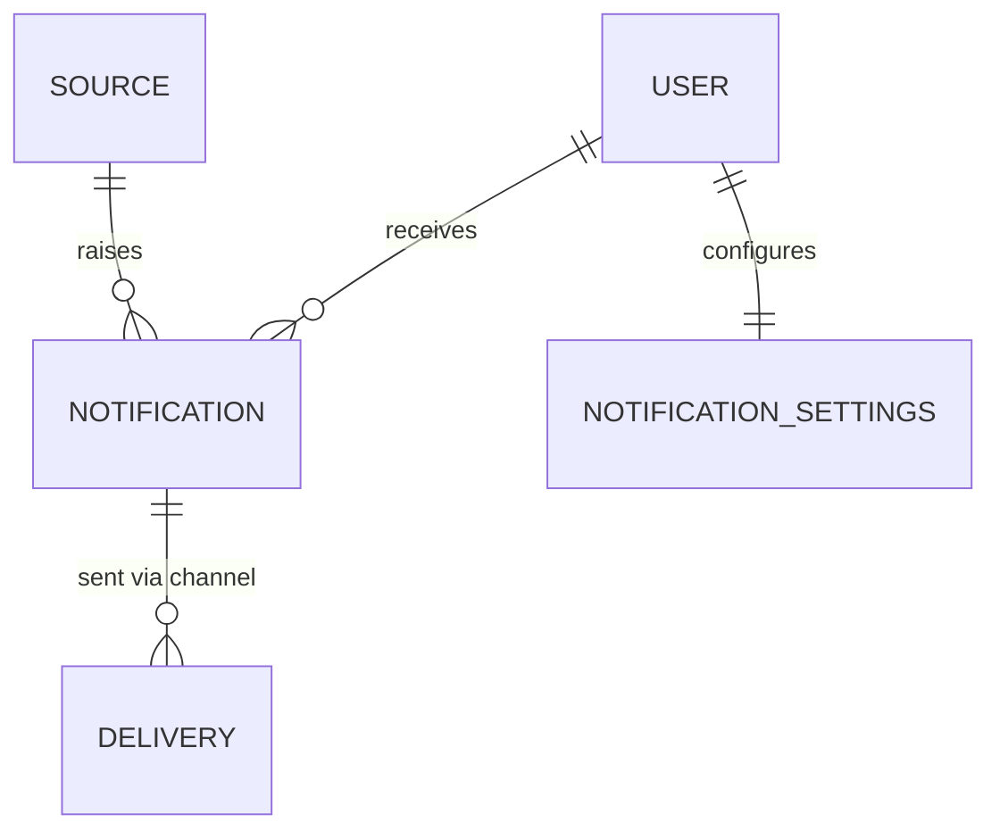

# SelfHandler — Notifications subsystem

> Cross-cutting mechanism for delivering reminders across all modules. Separated from the Planner (Planner = WHAT is scheduled; Notifications = HOW and WHEN we report it) and from the Recurrence engine (which provides the occurrence status; Notifications deliver and escalate it).
>
> Links: [Recurrence Engine](recurrence-engine.md) (the source of "what to remind about") · [Modules Spec](modules.md) (the hub for dates/events) · decisions: [Decisions Log](decisions.md)

---

## Purpose and consumers

| Module | What we remind about | Notes |
|--------|----------------------|-------|
| 0 Profile | "Time to weigh in / take measurements" | once a month |
| 2a Supplements | Intake + **re-reminder if not taken** | escalation |
| 3 Workouts | Date of the next workout | — |
| 4 Goals | A goal deadline is approaching | — |
| 5 Planner | Events of the day, tasks with a date | hub |
| 6 Report | "Fill in / review the evening report" | key ritual |
| 8 Habits | Habit time (implementation intention) | — |
| 10 Finances | Payment / paycheck / emergency-fund top-up, budget warning | — |

Without a single subsystem, every module would roll its own delivery → no shared quiet hours, deduplication, channel selection, or escalation.

---

## Decisions (fixed 2026-06-13)

- **Channels — a unified contract for all, in-app first.** A Strategy/Adapter layer on top of **Laravel Notifications**: in-app (DB channel) is enabled now; push (FCM/Capacitor) / email / Telegram are adapters that can be added without a rewrite. (Same pattern as the BYOK providers in [Modules Spec](modules.md).)
- **Escalation — repeat at an interval until marked done.** If a reminder is not "closed" (the task is not marked done), repeat after N minutes, at most K times, until it is marked done or overdue. Interval and limit are configurable per type.
- **Anti-spam — quiet hours + daily digest.** Global "do not disturb" (night) + collapsing minor reminders into a single digest ("3 tasks for today").

---

## The `Notification` entity (in-app record)

- `id`, `user_id`
- **Polymorphic source** `source_type` + `source_id` — what produced it (engine's PlannedOccurrence / goal deadline / budget warning / manual). Most often a `PlannedOccurrence` from the [Recurrence Engine](recurrence-engine.md)
- `type` / `category` — for grouping and settings (supplement intake / payment / report / habit …)
- `title`, `body`, optional `action` (deep link into a module: "mark intake", "open report")
- `scheduled_at` — when to show/deliver (UTC, see time zones)
- `status`: `scheduled` / `sent` / `read` / `dismissed` / `snoozed` / `actioned` / `cancelled`
- `channels` — which channels it went out through (in-app always + optional push/telegram/email)
- Escalation: `escalation_count`, `next_escalation_at`, `max_escalations`
- `snoozed_until` (optional)

> ⚠️ A notification does NOT duplicate the domain status. "Task done" lives in `PlannedOccurrence.status` (the engine). A notification merely reports it; once the task is marked done (occurrence → done) the related notifications are auto-closed (`actioned` / `cancelled`).

---

## Channels (Strategy/Adapter)

- A unified `NotificationChannel` contract (a "deliver" method): `deliver(Notification, recipientPrefs)`
- Implementations:
  - **in-app** (DB) — the in-app list, an unread badge. Enabled now
  - **local push** (Capacitor Local Notifications) — serverless, for the evening ritual. Early candidate
  - **push** (FCM/Web Push) — server-based, later
  - **telegram** (bot) — an external channel, later (concept reference: skill telegram-mcp-setup)
  - **email** — later
- Channel selection per notification type comes from the **user's settings** (see below). Channel resolution happens at runtime (a factory keyed by type + settings)

---

## Notification settings (per-user)

- **Global quiet hours** (e.g. 23:00–08:00) — during this window we do not deliver (we defer to the end of quiet hours or fold into the digest)
- **Per-category settings:** on/off + which channels (supplement intake → in-app + push; budget → in-app only)
- **Daily digest:** time (e.g. 08:00) — collect the minor/non-urgent items into one digest notification, "N tasks for today"
- Time zone/language — from the profile ([Modules Spec](modules.md))
- 📌 lives in a single settings home (candidate — a future Settings module)

---

## "Re-reminder" escalation (Module 2a case)

- Trigger: the related `PlannedOccurrence` is still `planned` after `occurrence_time`
- Repeat: after `escalation_interval` (e.g. 30 min), incrementing `escalation_count`, up to `max_escalations` (e.g. 3) OR until the occurrence is `done` / `skipped` / overdue
- Interval and limit are **configurable per type** (supplements are more insistent than "iron a shirt")
- Stops on: marking the task done (done), a manual dismiss, the onset of quiet hours (deferred), reaching the limit → the task moves to "missed"
- ⚠️ Escalation **reads** the status from the Recurrence engine but **lives here** (not in the engine) — this is exactly the responsibility boundary

---

## Delivery — how it is sent technically

- **Scheduler (Laravel Scheduler + queue):** a periodic job picks up `Notification` records with `status=scheduled` and `scheduled_at <= now` (and outside quiet hours) → delivers them through the selected channels → `sent`
- The source of most notifications is materialized `PlannedOccurrence` records (the engine): on/after materializing an occurrence, a scheduled notification is created per the type's rules
- **Idempotency:** uniqueness on `(source_type, source_id, escalation_count)` — the job won't double-deliver on restart
- The daily digest is a separate job at the configured time: it aggregates the day's non-urgent items into a single notification

---

## Responsibility boundaries

| Mechanism | Responsible for | NOT responsible for |
|-----------|-----------------|---------------------|
| [Recurrence Engine](recurrence-engine.md) | what is scheduled and when, occurrence status | delivery, reminders |
| **Notifications (this doc)** | delivery, channels, escalation, quiet hours, digest | the domain logic of the fact, the schedule |
| [Modules Spec](modules.md) | the dates/events hub, day planning, calendar UI | the delivery mechanics |
| Owning module | the domain fact (deduct stock, reduce debt) | reminders |

---

## Diagram

---

## Open questions (to resolve during implementation)

1. Whether to store `DELIVERY` as a separate table (per-channel history) or as a `channels` array on the notification — depends on the need to audit delivery.
2. Quiet hours: defer to the end of the window vs fold into the morning digest (or let the user choose).
3. Deduplication when multiple sources map to one task (occurrence + a manual reminder about the same thing).
4. Where to draw the line between "urgent (send immediately) vs non-urgent (into the digest)" — a flag on the type.
5. Push for Capacitor: local notifications (serverless) vs FCM (server) — which one for the first real version.
6. A snapshot of settings at notification-creation time vs reading the current ones at delivery time.
