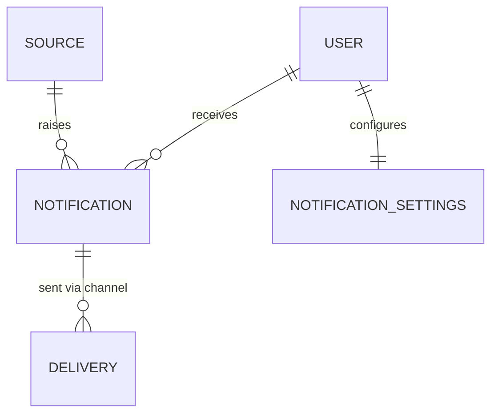

# SelfHandler — Подсистема Уведомлений (Notifications)

> Сквозной механизм доставки напоминаний на все модули. Отделена от Планнера (Планнер = ЧТО запланировано; Уведомления = КАК и КОГДА об этом сообщаем) и от Движка повторений (тот даёт статус экземпляра; Уведомления его доставляют и эскалируют).
>
> Связки: [Recurrence Engine](recurrence-engine.md) (источник «что напомнить») · [Modules Spec](modules.md) (хаб дат/событий) · решения: [Decisions Log](decisions.md)

---

## Зачем и кто потребители

| Модуль | Что напоминаем | Особенность |
|--------|----------------|-------------|
| 0 Профиль | «Пора взвеситься / сделать замеры» | раз в месяц |
| 2а Добавки | Приём + **повторно если не закинулся** | эскалация |
| 3 Тренировки | Дата следующей тренировки | — |
| 4 Цели | Дедлайн цели приближается | — |
| 5 Планнер | События дня, задачи с датой | хаб |
| 6 Отчёт | «Заполни/посмотри вечерний отчёт» | ключевой ритуал |
| 8 Привычки | Время привычки (implementation intention) | — |
| 10 Финансы | Платёж/зарплата/пополнение подушки, предупреждение бюджета | — |

Без единой подсистемы каждый модуль слепит свою рассылку → нельзя единые «тихие часы», дедупликацию, выбор канала, эскалацию.

---

## Решения (зафиксировано 2026-06-13)

- **Каналы — единый контракт под все, in-app первым.** Strategy/Adapter поверх **Laravel Notifications**: in-app (БД-канал) включаем сейчас; push (FCM/Capacitor) / email / Telegram — адаптеры, добавляются без переделки. (Паттерн как BYOK-провайдеры в [Modules Spec](modules.md).)
- **Эскалация — повтор через интервал до отметки.** Если напоминание не «закрыто» (дело не отмечено) — повтор через N минут, макс K раз, пока не отмечено/просрочено. Интервал и лимит — настраиваемы по типу.
- **Антиспам — тихие часы + дневная сводка.** Глобальные «не беспокоить» (ночь) + сворачивание мелких напоминаний в одну сводку («3 дела на сегодня»).

---

## Сущность `Notification` (in-app запись)

- `id`, `user_id`
- **Полиморфный источник** `source_type` + `source_id` — что породило (PlannedOccurrence движка / дедлайн цели / предупреждение бюджета / ручное). Чаще всего — `PlannedOccurrence` из [Recurrence Engine](recurrence-engine.md)
- `type` / `category` — для группировки и настроек (приём добавки / платёж / отчёт / привычка …)
- `title`, `body`, опц. `action` (deep-link в модуль: «отметить приём», «открыть отчёт»)
- `scheduled_at` — когда показать/доставить (UTC, см. таймзоны)
- `status`: `scheduled` / `sent` / `read` / `dismissed` / `snoozed` / `actioned` / `cancelled`
- `channels` — через какие каналы ушло (in-app всегда + опц. push/telegram/email)
- Эскалация: `escalation_count`, `next_escalation_at`, `max_escalations`
- `snoozed_until` (опц.)

> ⚠️ Уведомление НЕ дублирует доменный статус. «Дело сделано» живёт в `PlannedOccurrence.status` (движок). Уведомление лишь сообщает; при отметке дела (occurrence → done) связанные уведомления авто-закрываются (`actioned`/`cancelled`).

---

## Каналы (Strategy/Adapter)

- Единый контракт `NotificationChannel` (метод «доставить»): `deliver(Notification, recipientPrefs)`
- Реализации:
  - **in-app** (БД) — список в приложении, бейдж непрочитанного. Включён сейчас
  - **local push** (Capacitor Local Notifications) — без сервера, для вечернего ритуала. Ранний кандидат
  - **push** (FCM/Web Push) — серверный, позже
  - **telegram** (бот) — внешний канал, позже (референс концепции: skill telegram-mcp-setup)
  - **email** — позже
- Выбор каналов на тип уведомления — из **настроек пользователя** (см. ниже). Резолв канала в рантайме (фабрика по типу+настройкам)

---

## Настройки уведомлений (per-user)

- **Глобальные «тихие часы»** (напр. 23:00–08:00) — в этот период не доставляем (откладываем на конец тихих часов или сворачиваем в сводку)
- **Per-категория:** включено/выключено + какие каналы (приём добавок → in-app+push; бюджет → только in-app)
- **Дневная сводка:** время (напр. 08:00) — собрать мелкие/несрочные в одно сводное уведомление «N дел на сегодня»
- Таймзона/язык — из профиля ([Modules Spec](modules.md))
- 📌 живёт в едином доме настроек (кандидат — будущий модуль Settings)

---

## Эскалация «повторно напомнить» (кейс Модуля 2а)

- Триггер: связанный `PlannedOccurrence` остаётся `planned` после `occurrence_time`
- Повтор: через `escalation_interval` (напр. 30 мин), увеличивая `escalation_count`, до `max_escalations` (напр. 3) ИЛИ пока occurrence не `done`/`skipped`/просрочен
- Интервал и лимит — **настраиваемы по типу** (добавки — настойчивее, чем «погладить рубашку»)
- Останавливается при: отметке дела (done), ручном dismiss, наступлении тихих часов (переносится), достижении лимита → дело уходит в «пропущено»
- ⚠️ эскалация **читает** статус из Движка повторений, но **живёт здесь** (не в движке) — это и есть граница ответственности

---

## Доставка — как технически шлётся

- **Планировщик (Laravel Scheduler + queue):** периодическая джоба берёт `Notification` с `status=scheduled` и `scheduled_at <= now` (и вне тихих часов) → доставляет через выбранные каналы → `sent`
- Источник большинства уведомлений — материализованные `PlannedOccurrence` (Движок): при/после материализации для occurrence создаётся scheduled-уведомление по правилам типа
- **Идемпотентность:** уникальность по `(source_type, source_id, escalation_count)` — джоба не задвоит доставку при рестарте
- Дневная сводка — отдельная джоба в заданное время: агрегирует несрочные за день в одно уведомление

---

## Границы ответственности

| Механизм | Отвечает за | НЕ отвечает за |
|----------|-------------|----------------|
| [Recurrence Engine](recurrence-engine.md) | что и когда запланировано, статус экземпляра | доставку, напоминания |
| **Уведомления (этот док)** | доставку, каналы, эскалацию, тихие часы, сводку | доменную логику факта, расписание |
| [Modules Spec](modules.md) | хаб дат/событий, планирование дня, UI календаря | механику доставки |
| Модуль-владелец | доменный факт (списать остаток, уменьшить долг) | напоминания |

---

## Диаграмма

---

## Открытые вопросы (решить при реализации)

1. Хранить ли `DELIVERY` отдельной таблицей (история по каналам) или массивом `channels` на уведомлении — зависит от нужды в аудите доставки.
2. Тихие часы: откладывать на конец периода vs сворачивать в утреннюю сводку (или выбор юзера).
3. Дедупликация при множестве источников на одно дело (occurrence + ручное напоминание о том же).
4. Где провести границу «срочное (шлём сразу) vs несрочное (в сводку)» — флаг на типе.
5. Push для Capacitor: local notifications (без сервера) vs FCM (сервер) — что в первой реальной версии.
6. Снэпшот настроек на момент создания уведомления vs чтение актуальных при доставке.
