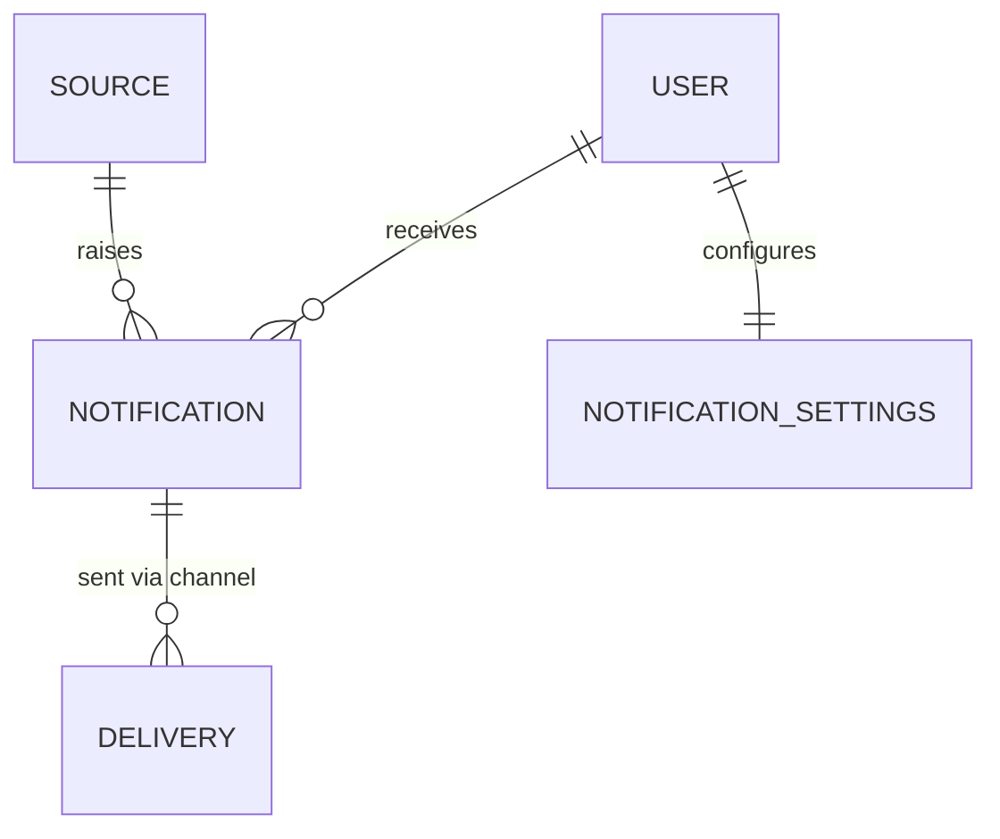

# SelfHandler — Notifications subsystem

> Cross-cutting mechanism for delivering reminders across all modules. Separated from the Planner (Planner = WHAT is scheduled; Notifications = HOW and WHEN we report it) and from the Recurrence engine (which provides the occurrence status; Notifications deliver and escalate it).
>
> Links: [Recurrence Engine](recurrence-engine.md) (the source of "what to remind about") · [Modules Spec](modules.md) (the hub for dates/events) · decisions: [Decisions Log](decisions.md)

---

## Purpose and consumers

| Module | What we remind about | Notes |
|--------|----------------------|-------|
| 0 Profile | "Time to weigh in / take measurements" | once a month |
| 2a Supplements | Intake + **re-reminder if not taken** | escalation |
| 3 Workouts | Date of the next workout | — |
| 4 Goals | A goal deadline is approaching | — |
| 5 Planner | Events of the day, tasks with a date | hub |
| 6 Report | "Fill in / review the evening report" | key ritual |
| 8 Habits | Habit time (implementation intention) | — |
| 10 Finances | Payment / paycheck / emergency-fund top-up, budget warning | — |

Without a single subsystem, every module would roll its own delivery → no shared quiet hours, deduplication, channel selection, or escalation.

---

## Decisions (fixed 2026-06-13; first implemented 2026-08-13)

- **Channels — a unified contract for all, in-app first.** A Strategy/Adapter layer using Laravel's
  scheduler and queue: the richer scheduled in-app record is enabled now; push (FCM/Capacitor), email,
  and Telegram are adapters that can be added without rewriting sources. Laravel's generic database
  notification payload is deliberately not stored beside it because it cannot represent schedule,
  snooze, source closure, and escalation without becoming a second drifting record. (Same adapter
  pattern as the BYOK providers in [Modules Spec](modules.md).)
- **Escalation — repeat at an interval until marked done.** If a reminder is not "closed" (the task is not marked done), repeat after N minutes, at most K times, until it is marked done or overdue. Interval and limit are configurable per type.
- **Anti-spam — quiet hours + daily digest.** Global "do not disturb" (night) + collapsing minor reminders into a single digest ("3 tasks for today").

---

## The `Notification` entity (in-app record)

- `id`, `user_id`
- **Polymorphic source** `source_type` + `source_id` — what produced it (engine's PlannedOccurrence / goal deadline / budget warning / manual). Most often a `PlannedOccurrence` from the [Recurrence Engine](recurrence-engine.md)
- `type` / `category` — for grouping and settings (supplement intake / payment / report / habit …)
- `title`, `body`, optional `action_url` (a safe relative deep link into a module: "mark intake", "open report")
- `content` — bounded rendering parameters kept until delivery; `title`/`body` are rendered in the
  recipient's current profile locale at delivery time
- `scheduled_at` — when to show/deliver (UTC, see time zones)
- `status`: `scheduled` / `sent` / `read` / `dismissed` / `snoozed` / `actioned` / `cancelled`
- `channels` — which channels it went out through (in-app always + optional push/telegram/email)
- Escalation: `escalation_count`, `next_escalation_at`, `max_escalations`
- `snoozed_until` (optional)

> ⚠️ A notification does NOT duplicate the domain status. "Task done" lives in `PlannedOccurrence.status` (the engine). A notification merely reports it; once the task is marked done (occurrence → done) the related notifications are auto-closed (`actioned` / `cancelled`).

---

## Channels (Strategy/Adapter)

- A unified `NotificationChannel` contract (a "deliver" method): `deliver(Notification, recipientPrefs)`
- Implementations:
  - **in-app** (DB) — the in-app list, an unread badge. Enabled now
  - **Android local presentation** (Capacitor Local Notifications) — enabled by feature 012 for unread
    events already delivered to the in-app inbox after a foreground/resume synchronisation
  - **push** (FCM/Web Push) — server-based, later
  - **telegram** (bot) — an external channel, later (concept reference: skill telegram-mcp-setup)
  - **email** — later
- Channel selection per notification type comes from the **user's settings** (see below). Channel resolution happens at runtime (a factory keyed by type + settings)

---

## Notification settings (per-user)

- **Global quiet hours** (e.g. 23:00–08:00) — during this window delivery is deferred to the first
  allowed instant. The interval may cross midnight; the profile time zone supplies its wall clock
- **Per-category settings:** on/off now; channel choices arrive when more than one channel exists
- **Daily digest:** time (e.g. 08:00) — collect the minor/non-urgent items into one digest notification, "N tasks for today"
- Time zone/language — from the profile ([Modules Spec](modules.md))
- 📌 lives in a single settings home (candidate — a future Settings module)

---

## "Re-reminder" escalation (Module 2a case)

- Trigger: the related `PlannedOccurrence` is still `planned` after `occurrence_time`
- Repeat: after `escalation_interval` (e.g. 30 min), incrementing `escalation_count`, up to `max_escalations` (e.g. 3) OR until the occurrence is `done` / `skipped` / overdue
- Interval and limit are **configurable per type** (supplements are more insistent than "iron a shirt")
- Stops on: marking the task done, skip/overdue, manual dismiss, disabled category, or reaching the
  limit. Quiet hours defer the repeat. Reaching the notification limit does **not** move the task to
  `missed`; only the owning module may make that domain transition
- ⚠️ Escalation **reads** the status from the Recurrence engine but **lives here** (not in the engine) — this is exactly the responsibility boundary

---

## Delivery — how it is sent technically

- **Scheduler (Laravel Scheduler + queue):** every minute a unique per-user job reconciles sources,
  builds a due digest, creates due escalation records, and picks up notifications with
  `status=scheduled` and `scheduled_at <= now` (or due snoozes) → quiet-hours check → selected channels → `sent`
- The source of most notifications is materialized `PlannedOccurrence` records (the engine): on/after materializing an occurrence, a scheduled notification is created per the type's rules
- **Idempotency:** uniqueness on `(user_id, source_type, source_id, escalation_count)` — the job won't
  duplicate another account's record or double-deliver on restart
- The same per-user job creates a synthetic daily-digest source at the configured local time. Its
  `YYYYMMDD` source id makes one digest per user/local day portable across MySQL and SQLite

### First consumers (feature 011)

- A timed, still-planned `PlannedOccurrence` receives a direct reminder. Routine policy is 30 minutes,
  at most two repeats; later source types may select a different policy.
- An open, high-priority Storage task due on the current local day receives a direct reminder at the
  configured digest wall time because Storage currently owns a date, not a time.
- Untimed planned occurrences and other open due Storage tasks are minor items counted in one daily
  digest. Direct sources are excluded from the digest.
- Settings are read when processing/delivering, not snapshotted when the row is created. Delivered copy
  remains an event record in that delivery locale.

---

## Responsibility boundaries

| Mechanism | Responsible for | NOT responsible for |
|-----------|-----------------|---------------------|
| [Recurrence Engine](recurrence-engine.md) | what is scheduled and when, occurrence status | delivery, reminders |
| **Notifications (this doc)** | delivery, channels, escalation, quiet hours, digest | the domain logic of the fact, the schedule |
| [Modules Spec](modules.md) | the dates/events hub, day planning, calendar UI | the delivery mechanics |
| Owning module | the domain fact (deduct stock, reduce debt) | reminders |

---

## Diagram

```mermaid
erDiagram
    USER ||--o{ NOTIFICATION : receives
    USER ||--|| NOTIFICATION_SETTINGS : configures
    SOURCE ||--o{ NOTIFICATION : raises
    NOTIFICATION ||--o{ DELIVERY : "sent via channel"

    %% SOURCE = PlannedOccurrence (most common) / goal deadline / budget warning / manual
    %% DELIVERY = the fact of sending via a specific channel (in-app/push/telegram/email)
```

---

## Implementation resolutions and remaining question

Resolved by feature 011:

1. Successful adapters live in the notification's `channels` array. A separate delivery-attempt table
   waits for a concrete second channel and an auditing need.
2. Quiet hours always defer to their end; they never discard or silently fold a direct reminder.
3. Portable source alias + source id + escalation count is the deduplication boundary. A future manual
   reminder must name a distinct source rather than collide with an occurrence.
4. Timed occurrences and high-priority dated tasks are direct; untimed occurrences and ordinary dated
   tasks enter the digest. New modules must classify their own source explicitly.
5. Current settings and profile locale are read at delivery, so a change applies to already scheduled
   records.

Resolved by feature 012:

1. The first Android adapter uses Capacitor Local Notifications only. It requests OS permission only
   after an explicit action in Notifications and creates the `selfhandler-reminders` channel after
   permission is granted.
2. It mirrors only `sent` inbox records without `android_local`, comparing a stable signed-32-bit native
   id and the original server id against pending and delivered native notifications before scheduling.
3. The server appends `android_local` idempotently only after successful local scheduling. That channel
   is presentation evidence; it does not change unread or domain state.
4. A tap accepts only the Planner or Notifications relative route and marks the inbox event read on a
   best-effort basis. Any invalid action opens the inbox.
5. This adapter cannot wake a stopped app. FCM, background push, exact alarms, and generalized delivery
   audit rows remain deferred until a feature needs them.

Extended by feature 013:

1. A timed planned habit occurrence produces the `habit_reminder` type in the independently configurable
   `habit` category. Existing users and older settings rows receive an enabled default on read.
2. The notification keeps the planned occurrence as its source identity, so repeated synchronisation
   deduplicates it and a habit fact closes it through the existing disposition path.
3. Untimed habits create no direct reminder and are not guessed into a time. Habit reminders do not
   enter the routine/task daily digest in this increment.
4. EN/RU/UK rendering, quiet hours, escalation and Android local presentation are unchanged shared
   delivery concerns; push and stopped-app wakeup remain deferred.

Extended by feature 014:

1. Planned bedtimes produce `sleep_reminder` records in a backwards-compatible enabled `sleep`
   category. They reuse the planned occurrence identity, quiet hours, locale rendering, dedupe,
   escalation, snooze, and Android presentation paths.
2. Routine synchronization asks the routine day projection for the selected morning/evening work;
   unselected or explicitly empty slots create no reminder and close stale pending delivery.
3. Pausing or archiving a SleepPlan removes its unfactored future occurrences and cancels delivery;
   historical planned wake snapshots and sleep facts remain untouched.
4. Push, stopped-app wakeup, alarms, and provider-specific bedtime delivery remain deferred.

Extended by feature 015:

1. A timed pending workout occurrence produces `workout_reminder` in a backwards-compatible enabled
   `workout` category; older settings rows receive the default at read time.
2. The program occurrence remains the source identity, so synchronisation, escalation, snooze, quiet
   hours, locale rendering, Android presentation, and fact/lifecycle closure reuse the shared path.
3. Untimed workouts are not assigned an invented time and race goal deadlines remain Planner events,
   not reminders, in this increment.
4. Provider push, stopped-app wakeup, wearable-triggered delivery, and coaching notifications remain
   deferred.
