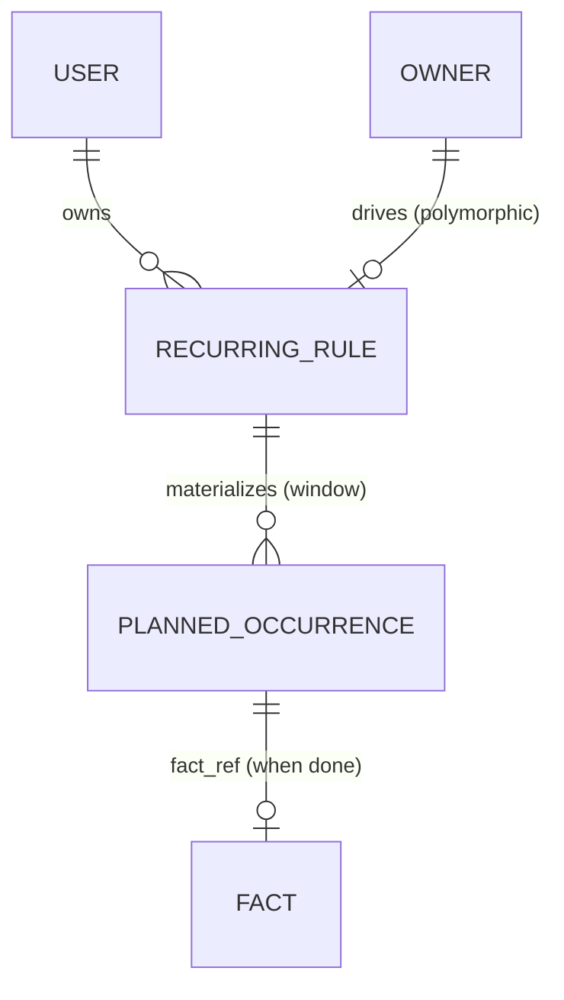

# SelfHandler — Движок повторений (Recurrence Engine)

> Сквозной механизм на всё приложение. Один формат повторяющихся правил + разворачивание в конкретные запланированные экземпляры. Используют 6+ модулей. **Проектируется ДО кода** — переделка после написания катастрофична (затрагивает планировщик, уведомления, все модули-потребители).
>
> Канон-имена: [Modules Spec](modules.md) · Решения: [Decisions Log](decisions.md)

---

## Зачем и кто потребители

| Модуль | Что повторяется | Пример паттерна |
|--------|-----------------|-----------------|
| 0 Профиль | Замеры тела | раз в месяц |
| 1 Режим/сон | Рутины дня | каждый день / по дням недели |
| 2а Добавки | Курсы приёма | 2×/день; пн,чт; неделя приёма/неделя пауза |
| 3 Тренировки | Программа/сплит | пн/ср/пт; через день |
| 5 Планнер | События, задачи с повтором | произвольные |
| 8 Привычки | Частота привычки | каждый день; N×/нед; N×/день |
| 10 Финансы | Зарплата, платежи, подушка | 3×/мес по датам; ежемесячно |

Без единого движка каждый изобретёт своё расписание → несовместимые форматы → переписывать планировщик и уведомления во всех модулях.

---

## Решения (зафиксировано 2026-06-13)

- **Формат правила — свой набор полей** (не RRULE как основа), но с **опциональным полем `rrule` как запасным выходом** для редких сложных случаев (страховка: не переписывать движок, если самодельной модели не хватит).
- **Разворачивание — материализация с окном вперёд** (плановые экземпляры пишутся в БД на N дней вперёд, напр. +90), идемпотентно.
- **Движок хранит статус экземпляра** (план/выполнено/пропущено/перенесено). **Эскалация и доставка напоминаний — НЕ здесь**, а в будущей подсистеме Уведомлений (чистое разделение «что запланировано» vs «как напоминаем»).

---

## Сущность `RecurringRule` — правило повторения

### Общие поля
- `id`, `user_id`
- **Полиморфный владелец** `owner_type` + `owner_id` — кто породил правило (добавка / тренировка-программа / привычка / фин-операция / долг / копилка / задача / замер-напоминание)
- `dtstart` — дата(-время) старта
- `timezone` — таймзона правила (хранение в UTC, разворот с учётом TZ — см. «Таймзоны»)
- Окончание (одно из): `until` (дата) / `count` (N повторений) / бессрочно (null)
- `is_active` (пауза/возобновление без удаления)

### Модель паттерна — свой набор полей
- **`freq`** (enum): `daily` / `weekly` / `monthly` / `yearly`
- **`interval`** (int, по умолчанию 1) — «каждые N единиц freq». Покрывает **«через день»** = `daily, interval=2`
- **`by_weekday`** (массив) — дни недели для `weekly` (пн,чт = `[MO, TH]`). Покрывает «N раз/нед по дням»
- **`by_monthday`** (массив) — числа месяца для `monthly` (зарплата 5/15/25 = `[5, 15, 25]`). Покрывает «3×/мес по датам»
- **`times_per_day`** (массив времён или меток) — несколько приёмов в день: `[{time: "08:00", label: "утро", with_food: true}, {time: "20:00", label: "вечер"}]`. Покрывает «2×/день, с едой/натощак»

### Циклические паттерны (отдельный блок — то, на чём ломаются самоделки)
- **`cycle_on` / `cycle_off`** (int дней) — «N дней приёма / M дней паузы». Пример: неделя приёма / неделя пауза = `cycle_on=7, cycle_off=7`. Разворот: от `dtstart` чередуем on/off-окна, экземпляры только в on-окнах
- Покрывает кейс добавок «неделя приёма / неделя пауза», «3 недели приём / 1 неделя пауза» (циклы курса)

### Запасной выход
- **`rrule`** (string, опц.) — если ни одно поле выше не покрывает кейс, кладётся RFC 5545 строка; разворот делегируется RRULE-парсеру (либа). На старте поддерживаем подмножество, поле существует для будущего. ⚠️ если `rrule` задан — он приоритетен, остальные поля игнорируются (или валидатор запрещает смешивать)

### Данные нагрузки (payload) — зависят от владельца
- Правило несёт минимум расписания. **Что именно планируется** (сумма платежа, доза добавки, тип тренировки) — в полиморфном владельце или в `payload` (JSON), чтобы движок не знал доменных деталей

---

## Сущность `PlannedOccurrence` — запланированный экземпляр

- `id`, `rule_id` (FK → RecurringRule), `user_id` (денормализовано для scope)
- **`occurrence_date`** (дата) + опц. `occurrence_time` (из `times_per_day`)
- **`slot`** (опц.) — метка времени дня для мультиразовых («утро»/«вечер»)
- **`status`** (enum): `planned` / `done` / `skipped` / `rescheduled`
- **`fact_ref`** — полиморфная ссылка на фактическую доменную запись (транзакция / приём добавки / выполненная тренировка / отметка привычки), когда `done`
- `rescheduled_to` (опц.) — новая дата при переносе (см. «Пропуски и перенос»)
- `materialized_at` — когда строка создана движком

### Идемпотентность (критично)
- **Уникальный ключ `(rule_id, occurrence_date, slot)`** → повторный разворот = no-op (upsert), без дублей при сбое/рестарте джобы
- `RecurringRule.last_materialized_until` — докуда правило уже развёрнуто; материализация двигает эту границу вперёд

---

## Материализация — окно вперёд

- Плановые экземпляры создаются в БД **на окно вперёд** (напр. +90 дней) фоновой джобой (Laravel Scheduler/queue)
- Джоба периодически продлевает окно: для каждого активного правила разворачивает экземпляры от `last_materialized_until` до `now + 90д`, upsert по уникальному ключу
- **Почему материализация, а не на лету:** нужно отмечать КОНКРЕТНЫЙ экземпляр (этот приём пропущен / этот платёж перенесён) — а отметку вешать не на что, если экземпляров нет в БД
- Далёкое будущее (>окна) при необходимости показываем вычислением на лету (read-only превью), без записи

---

## Пропуски и перенос

- **Пропуск:** статус `skipped` → идёт в аналитику/отчёт как «не сделано» (дисциплина)
- **Перенос:** статус `rescheduled` + `rescheduled_to`; создаётся (или сдвигается) экземпляр на новую дату. Юзер выбирает пропустить или перенести (см. [Modules Spec](modules.md))
- **Правка одного экземпляра ≠ правка правила:** перенос/отмена одной даты не меняет правило (как «эту встречу перенёс, серия осталась»)
- ❓ правка правила задним числом (изменил расписание) — что с уже материализованными будущими экземплярами: перегенерить непомеченные, сохранить помеченные. Финализировать при реализации

---

## Границы ответственности (что НЕ входит)

- **Доставка/эскалация напоминаний** — подсистема [Notifications](notifications.md) (спроектирована 2026-06-13). Движок лишь даёт «что и когда запланировано» + статус. «Повторно напомнить если не закинулся» (Модуль 2а) — это эскалация в Уведомлениях, читающая `status=planned` после `occurrence_time`
- **Доменная логика факта** — в модуле-владельце (списать остаток добавки, уменьшить долг). Движок только связывает occurrence ↔ факт через `fact_ref`
- **Прогноз запасов** (когда кончится добавка) — это НЕ движок повторений (см. [Modules Spec](modules.md)); прогноз порождает разовый плановый расход, а не правило

---

## Таймзоны

- Хранение в БД — **UTC**; `RecurringRule.timezone` — таймзона юзера (из профиля)
- Разворот расписания — с учётом TZ правила (иначе «08:00 утра» поплывёт при смене TZ/переезде)
- `dtstart` хранит TZ-aware момент

---

## Диаграмма

---

## Открытые вопросы (решить при реализации)

1. Размер окна материализации (+90д? зависит от того, как далеко смотрит Планнер/календарь).
2. Правка правила задним числом → судьба уже материализованных будущих экземпляров (перегенерить непомеченные).
3. `payload` (JSON на правиле) vs хранить доменные данные только в полиморфном владельце.
4. Поддерживаемое подмножество `rrule` на старте (если вообще включаем парсер в MVP движка).
5. Нужен ли `slot` отдельной колонкой или хватит `occurrence_time` (для мультиразовых в день).
6. Как Планнер (Модуль 5) агрегирует occurrences всех модулей в единый календарь — вью/контракт `Schedulable`.
