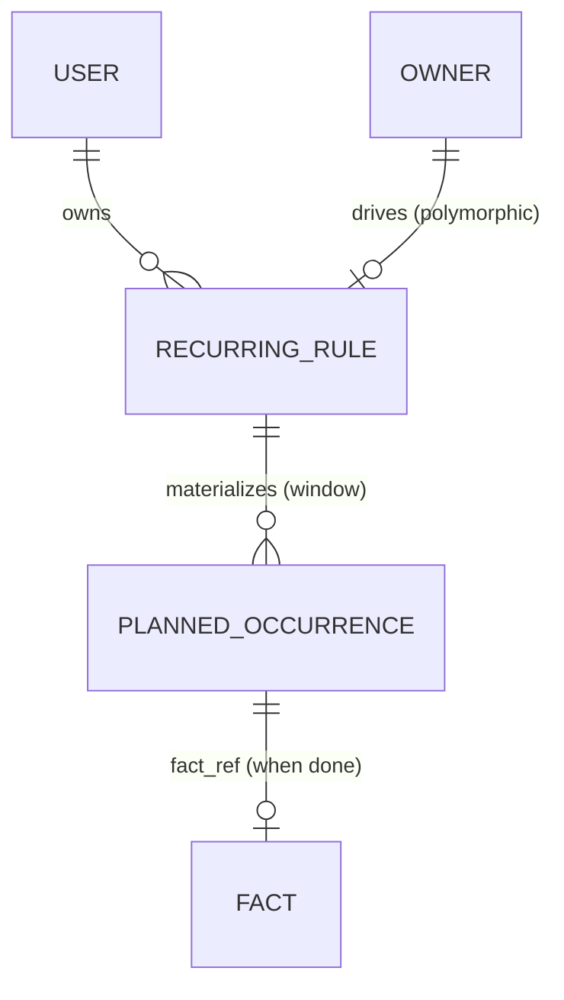

# SelfHandler — Recurrence Engine

> A cross-cutting mechanism spanning the entire application. A single recurring-rule format plus expansion (materialization) into concrete planned occurrences. Used by 6+ modules. **Designed BEFORE the code** — reworking it after implementation is catastrophic (it touches the scheduler, notifications, and every consumer module).
>
> Canonical names: [Modules Spec](modules.md) · Decisions: [Decisions Log](decisions.md)

---

## Why It Exists and Who the Consumers Are

| Module | What recurs | Example pattern |
|--------|-----------------|-----------------|
| 0 Profile | Body measurements | once a month |
| 1 Routine/sleep | Daily routines | every day / by weekday |
| 2a Supplements | Intake courses | 2×/day; Mon, Thu; week on / week off |
| 3 Workouts | Program/split | Mon/Wed/Fri; every other day |
| 5 Planner | Recurring events and tasks | arbitrary |
| 8 Habits | Habit frequency | every day; N×/week; N×/day |
| 10 Finance | Salary, payments, emergency fund | 3×/month by date; monthly |

Without a single engine, every module would reinvent its own scheduling → incompatible formats → the scheduler and notifications would have to be rewritten across all modules.

---

## Decisions (locked in on 2026-06-13)

- **Rule format — a custom field set** (not RRULE as the foundation), but with an **optional `rrule` field as a fallback/escape hatch** for rare, complex cases (a safety net: no need to rewrite the engine if the hand-rolled model falls short).
- **Expansion — materialization with a look-ahead window** (planned occurrences are written to the database N days ahead, e.g. +90), idempotently.
- **The engine stores occurrence status** (planned / done / skipped / rescheduled). **Escalation and reminder delivery do NOT live here** but in the future Notifications subsystem (a clean separation of "what is scheduled" vs. "how we remind").

---

## The `RecurringRule` Entity — recurrence rule

### Common fields
- `id`, `user_id`
- **Polymorphic owner** `owner_type` + `owner_id` — what spawned the rule (supplement / workout program / habit / financial operation / debt / saving fund / task / measurement reminder)
- `dtstart` — start date (or datetime)
- `timezone` — the rule's time zone (stored in UTC; expanded with TZ taken into account — see "Time zones")
- End condition (one of): `until` (date) / `count` (N occurrences) / indefinite (null)
- `is_active` (pause/resume without deletion)

### Pattern model — a custom field set
- **`freq`** (enum): `daily` / `weekly` / `monthly` / `yearly`
- **`interval`** (int, default 1) — "every N units of freq". Covers **"every other day"** = `daily, interval=2`
- **`by_weekday`** (array) — weekdays for `weekly` (Mon, Thu = `[MO, TH]`). Covers "N times/week by weekday"
- **`by_monthday`** (array) — days of the month for `monthly` (salary on the 5th/15th/25th = `[5, 15, 25]`). Covers "3×/month by date"
- **`times_per_day`** (array of times or labels) — several intakes per day: `[{time: "08:00", label: "morning", with_food: true}, {time: "20:00", label: "evening"}]`. Covers "2×/day, with food / on an empty stomach"

### Cyclic patterns (a dedicated block — exactly where hand-rolled solutions break)
- **`cycle_on` / `cycle_off`** (int days) — "N days on / M days off". Example: week on / week off = `cycle_on=7, cycle_off=7`. Expansion: starting from `dtstart`, alternate on/off windows; occurrences fall only within on-windows
- Covers the supplement cases "week on / week off" and "3 weeks on / 1 week off" (course cycles)

### Fallback/escape hatch
- **`rrule`** (string, optional) — if none of the fields above cover the case, an RFC 5545 string is stored here and expansion is delegated to an RRULE parser (a library). At launch we support a subset; the field exists for the future. ⚠️ if `rrule` is set, it takes precedence and the other fields are ignored (or the validator forbids mixing them)

### Payload — depends on the owner
- A rule carries the bare minimum of scheduling. **What exactly is being planned** (payment amount, supplement dose, workout type) lives in the polymorphic owner or in `payload` (JSON), so that the engine stays unaware of domain details

---

## The `PlannedOccurrence` Entity — planned occurrence

- `id`, `rule_id` (FK → RecurringRule), `user_id` (denormalized for scoping)
- **`occurrence_date`** (date) + optional `occurrence_time` (from `times_per_day`)
- **`slot`** (optional) — a time-of-day label for multi-occurrence days ("morning" / "evening")
- **`status`** (enum): `planned` / `done` / `skipped` / `rescheduled`
- **`fact_ref`** — a polymorphic reference to the actual domain record (transaction / supplement intake / completed workout / habit check-off) once `done`
- `rescheduled_to` (optional) — the new date when rescheduled (see "Skips and reschedules")
- `materialized_at` — when the row was created by the engine

### Idempotency (critical)
- **Unique key `(rule_id, occurrence_date, slot)`** → re-expansion = a no-op (upsert), with no duplicates on a job failure/restart
- `RecurringRule.last_materialized_until` — how far the rule has already been expanded; materialization moves this boundary forward

---

## Materialization — look-ahead window

- Planned occurrences are created in the database **for a look-ahead window** (e.g. +90 days) by a background job (Laravel Scheduler/queue)
- The job periodically extends the window: for each active rule it expands occurrences from `last_materialized_until` up to `now + 90d`, upserting by the unique key
- **Why materialization rather than on-the-fly:** we need to mark a SPECIFIC occurrence (this intake was skipped / this payment was rescheduled) — and there is nothing to attach the mark to if the occurrences are not in the database
- The far future (beyond the window) is shown, when needed, by computing on the fly (a read-only preview), without writing

---

## Skips and reschedules

- **Skip:** status `skipped` → counts in analytics/reports as "not done" (discipline)
- **Reschedule:** status `rescheduled` + `rescheduled_to`; an occurrence on the new date is created (or shifted). The user chooses whether to skip or reschedule (see [Modules Spec](modules.md))
- **Editing a single occurrence ≠ editing the rule:** rescheduling/canceling a single date does not change the rule (much like "I moved this one meeting, but the series stays")
- ❓ editing a rule retroactively (changed the schedule) — what happens to already-materialized future occurrences: regenerate the unmarked ones, keep the marked ones. To be finalized during implementation

---

## Responsibility boundaries (what is NOT included)

- **Reminder delivery/escalation** — the [Notifications](notifications.md) subsystem (designed 2026-06-13). The engine only supplies "what is scheduled and when" + status. "Remind again if not taken" (Module 2a) is escalation in Notifications, reading `status=planned` after `occurrence_time`
- **Domain fact logic** — lives in the owner module (deduct the supplement's remaining stock, reduce the debt). The engine only links occurrence ↔ fact via `fact_ref`
- **Stock forecasting** (when a supplement will run out) — this is NOT the recurrence engine (see [Modules Spec](modules.md)); a forecast produces a one-off planned expense, not a rule

---

## Time zones

- Database storage — **UTC**; `RecurringRule.timezone` is the user's time zone (from the profile)
- Schedule expansion — with the rule's TZ taken into account (otherwise "8:00 a.m." would drift when the TZ changes or the user relocates)
- `dtstart` stores a TZ-aware moment

---

## Diagram

---

## Open questions (to resolve during implementation)

1. Materialization window size (+90d? depends on how far ahead the Planner/calendar looks).
2. Editing a rule retroactively → the fate of already-materialized future occurrences (regenerate the unmarked ones).
3. `payload` (JSON on the rule) vs. storing domain data only in the polymorphic owner.
4. The supported subset of `rrule` at launch (if we include a parser in the engine MVP at all).
5. Whether `slot` needs its own column or `occurrence_time` is enough (for multi-occurrence days).
6. How the Planner (Module 5) aggregates occurrences from all modules into a single calendar — a `Schedulable` view/contract.
