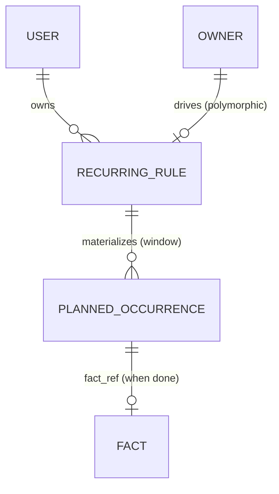

# SelfHandler — Recurrence Engine

> A cross-cutting mechanism spanning the entire application. A single recurring-rule format plus expansion (materialization) into concrete planned occurrences. Used by 6+ modules. **Designed BEFORE the code** — reworking it after implementation is catastrophic (it touches the scheduler, notifications, and every consumer module).
>
> Canonical names: [Modules Spec](modules.md) · Decisions: [Decisions Log](decisions.md)

---

## Why It Exists and Who the Consumers Are

| Module | What recurs | Example pattern |
|--------|-----------------|-----------------|
| 0 Profile | Body measurements | once a month |
| 1 Routine/sleep | Daily routines | every day / by weekday |
| 2a Supplements | Intake courses | 2×/day; Mon, Thu; week on / week off |
| 3 Workouts | Program/split | Mon/Wed/Fri; every other day |
| 5 Planner | Recurring events and tasks | arbitrary |
| 8 Habits | Habit frequency | every day; N×/week; N×/day |
| 10 Finance | Salary, payments, emergency fund | 3×/month by date; monthly |

Without a single engine, every module would reinvent its own scheduling → incompatible formats → the scheduler and notifications would have to be rewritten across all modules.

---

## Decisions (locked in on 2026-06-13)

- **Rule format — a custom field set** (not RRULE as the foundation), but with an **optional `rrule` field as a fallback/escape hatch** for rare, complex cases (a safety net: no need to rewrite the engine if the hand-rolled model falls short).
- **Expansion — materialization with a look-ahead window** (planned occurrences are written to the database N days ahead, e.g. +90), idempotently.
- **The engine stores occurrence status** (planned / done / skipped / rescheduled). **Escalation and reminder delivery do NOT live here** but in the future Notifications subsystem (a clean separation of "what is scheduled" vs. "how we remind").

---

## The `RecurringRule` Entity — recurrence rule

### Common fields
- `id`, `user_id`
- **Polymorphic owner** `owner_type` + `owner_id` — what spawned the rule (supplement / workout program / habit / financial operation / debt / saving fund / task / measurement reminder)
- `dtstart` — start date (or datetime)
- `timezone` — the rule's time zone (stored in UTC; expanded with TZ taken into account — see "Time zones")
- End condition (one of): `until` (date) / `count` (N occurrences) / indefinite (null)
- `is_active` (pause/resume without deletion)

### Pattern model — a custom field set
- **`freq`** (enum): `daily` / `weekly` / `monthly` / `yearly`
- **`interval`** (int, default 1) — "every N units of freq". Covers **"every other day"** = `daily, interval=2`
- **`by_weekday`** (array) — weekdays for `weekly` (Mon, Thu = `[MO, TH]`). Covers "N times/week by weekday"
- **`by_monthday`** (array) — days of the month for `monthly` (salary on the 5th/15th/25th = `[5, 15, 25]`). Covers "3×/month by date"
- **Normalized rule slots** — several occurrences per day are ordered `RecurringRuleSlot` rows with
  a stable label and local time. Owner-specific context stays in an owner detail row rather than in
  generic schedule JSON; Supplements uses `SupplementCourseSlot` for
  `unspecified|with_food|empty_stomach`.

### Cyclic patterns (a dedicated block — exactly where hand-rolled solutions break)
- **`cycle_on` / `cycle_off`** (int days) — "N days on / M days off". Example: week on / week off = `cycle_on=7, cycle_off=7`. Expansion: starting from `dtstart`, alternate on/off windows; occurrences fall only within on-windows
- Covers the supplement cases "week on / week off" and "3 weeks on / 1 week off" (course cycles)

### Fallback/escape hatch
- **`rrule`** (string, optional) — if none of the fields above cover the case, an RFC 5545 string is stored here and expansion is delegated to an RRULE parser (a library). At launch we support a subset; the field exists for the future. ⚠️ if `rrule` is set, it takes precedence and the other fields are ignored (or the validator forbids mixing them)

### Payload — depends on the owner
- A rule carries the bare minimum of scheduling. **What exactly is being planned** (payment amount, supplement dose, workout type) lives in the polymorphic owner or in `payload` (JSON), so that the engine stays unaware of domain details

---

## The `PlannedOccurrence` Entity — planned occurrence

- `id`, `rule_id` (FK → RecurringRule), `user_id` (denormalized for scoping)
- **`occurrence_date`** (date) + optional `occurrence_time` (from `times_per_day`)
- **`slot`** (optional) — a time-of-day label for multi-occurrence days ("morning" / "evening")
- **`status`** (enum): `planned` / `done` / `skipped` / `rescheduled`
- **`fact_ref`** — a polymorphic reference to the actual domain record (transaction / supplement intake / completed workout / habit check-off) once `done`
- `rescheduled_to` (optional) — the new date when rescheduled (see "Skips and reschedules")
- `materialized_at` — when the row was created by the engine

### Idempotency (critical)
- **Unique key `(rule_id, occurrence_date, slot)`** → re-expansion = a no-op (upsert), with no duplicates on a job failure/restart
- `RecurringRule.last_materialized_until` — how far the rule has already been expanded; materialization moves this boundary forward

---

## Materialization — look-ahead window

- Planned occurrences are created in the database **for a look-ahead window** (e.g. +90 days) by a background job (Laravel Scheduler/queue)
- The job periodically extends the window: for each active rule it expands occurrences from `last_materialized_until` up to `now + 90d`, upserting by the unique key
- **Why materialization rather than on-the-fly:** we need to mark a SPECIFIC occurrence (this intake was skipped / this payment was rescheduled) — and there is nothing to attach the mark to if the occurrences are not in the database
- The far future (beyond the window) is shown, when needed, by computing on the fly (a read-only preview), without writing

---

## Skips and reschedules

- **Skip:** status `skipped` → counts in analytics/reports as "not done" (discipline)
- **Reschedule:** status `rescheduled` + `rescheduled_to`; an occurrence on the new date is created (or shifted). The user chooses whether to skip or reschedule (see [Modules Spec](modules.md))
- **Editing a single occurrence ≠ editing the rule:** rescheduling/canceling a single date does not change the rule (much like "I moved this one meeting, but the series stays")
- **Editing a rule retroactively** (resolved 2026-08-12 by feature `006-unified-recurrence`): unmarked future occurrences are regenerated, and occurrences already linked to a fact are kept. A link to a fact is evidence that something happened; an unmarked future occurrence is only a prediction and is safe to replace.

---

## Responsibility boundaries (what is NOT included)

- **Reminder delivery/escalation** — the [Notifications](notifications.md) subsystem (designed 2026-06-13). The engine only supplies "what is scheduled and when" + status. "Remind again if not taken" (Module 2a) is escalation in Notifications, reading `status=planned` after `occurrence_time`
- **Domain fact logic** — lives in the owner module (deduct the supplement's remaining stock, reduce the debt). The engine only links occurrence ↔ fact via `fact_ref`
- **Stock forecasting** (when a supplement will run out) — this is NOT the recurrence engine (see [Modules Spec](modules.md)); a forecast produces a one-off planned expense, not a rule

---

## Time zones

- Database storage — **UTC**; `RecurringRule.timezone` is the user's time zone (from the profile)
- Schedule expansion — with the rule's TZ taken into account (otherwise "8:00 a.m." would drift when the TZ changes or the user relocates)
- `dtstart` stores a TZ-aware moment

---

## Diagram

```mermaid
erDiagram
    USER ||--o{ RECURRING_RULE : owns
    RECURRING_RULE ||--o{ PLANNED_OCCURRENCE : "materializes (window)"
    PLANNED_OCCURRENCE ||--o| FACT : "fact_ref (when done)"
    OWNER ||--o| RECURRING_RULE : "drives (polymorphic)"

    %% OWNER = supplement / workout program / habit / financial operation / debt / saving fund / task / measurement
    %% FACT  = transaction / supplement intake / completed workout / habit check-off
```

---

## Open questions

**Resolved by feature `006-unified-recurrence` (2026-08-12), the first implementation:**

1. **Materialization window size** — 90 days ahead of the owner's current local day, clamped by the
   rule's own start and end. Recorded on the rule as `last_materialized_until`.
2. **Editing a rule retroactively** — regenerate unmarked future occurrences, keep the ones linked to a
   fact. See "Skips and reschedules" above.
5. **`slot` versus `occurrence_time`** — both exist. `slot` is a non-null label (empty string for a
   single-slot day) so it can take part in the uniqueness key, which `NULL` cannot on MySQL;
   `occurrence_time` carries the time itself.

**Resolved by feature `009-planner-day` (2026-08-12):**

6. **How the Planner aggregates a day across modules** — a read-only source contract, not a shared
   occurrence table. `App\Contracts\SchedulableSource` is `name()` plus
   `entriesFor(User $user, string $date): array`, and each source returns `App\Support\PlannerEntry`
   values carrying the owning module's own id and status vocabulary. `SourceRegistry` lists the
   implementations and `DayAssembler` merges and orders them on every read.

   Three consequences worth stating, because they are what the contract is for:

   - **A source reads. Every write goes back to the module that owns the record.** Skipping a routine
     day writes the routine log Today already writes, so progress and streaks need no planner-specific
     branch; moving a task changes its due date through Storage. Planner keeps no parallel copy of
     either, which is why a day is assembled on every read rather than cached.
   - **The one exception is `planned_occurrences.rescheduled_to`.** A reschedule is a decision about a
     planned day rather than a fact about a routine, so it lives on the occurrence. It is a separate
     nullable column beside `occurrence_date`, never a replacement: overwriting the expanded date would
     make the next materialization see a missing day and recreate it as a duplicate, and would erase
     what was originally planned.
   - **A moved day is intent, and materialization must not delete it.** The stale-day sweep already
     spared occurrences linked to a fact; feature 009 extended it to spare rescheduled ones too. Without
     that, narrowing a rule would silently drop a day the user had deliberately moved somewhere else.

   Only Planner reads through the contract. A module adding itself to a day implements the interface and
   registers; nothing about the recurrence engine changes.

**Extended by feature `013-habits-anti-habits` (2026-08-13):**

- `habit` is the second `owner_type`; owner ids are always interpreted with their type, so numeric id
  collisions with routines are harmless.
- An occurrence may link to either `routine_log_id` or `habit_log_id`, never both. Materialization and
  reconcile preserve/rebuild both fact kinds while the owning module decides whether its fact succeeded.
- Habits implement a separate read-only Planner source. Generic rescheduling refuses fact-bound days;
  habit moves also refuse an effective-date collision because Habits owns one fact per local date.
- This increment supports daily and exact selected weekdays. Floating N-per-week quotas, multi-slot
  days, interval/monthly rules and arbitrary RRULE input remain deferred.

**Extended by feature `014-sleep-routine-templates` (2026-08-13):**

- `sleep_plan` is the third typed owner. Its occurrence time is planned bedtime and a one-to-one
  `SleepOccurrenceDetail` snapshots planned wake time atomically on plan-specific and global paths.
- `planned_occurrences.sleep_log_id` is the third mutually exclusive derived fact link. Reconcile
  rebuilds it without changing sleep facts or planned wake snapshots.
- Routine occurrences keep their existing source identity. A shared day projection filters morning
  and evening templates, passes anytime routines through, and preserves safe rescheduling semantics.
- Sleep Planner entries expose wake context and reschedule only; facts close all actions. Alarms,
  interval/monthly sleep rules, and wearable schedule imports remain deferred.

**Extended by feature `015-workouts-training-goals` (2026-08-13):**

- `workout_program` is the fourth typed owner. It uses the same daily/exact-weekday schedule and
  materialization window; the program keeps subtype targets while the rule keeps only schedule data.
- `planned_occurrences.workout_session_id` is the fourth mutually exclusive fact link. Completed and
  skipped sessions close an occurrence; correction preserves identity, and deletion clears the link
  and reopens the occurrence.
- Workout Planner entries allow skip/reschedule only while pending and deep-link to the effective date
  and program. Active race goals are a separate read-only Planner source, not fabricated recurrence.
- Multiple daily slots, interval/monthly programs, imported provider schedules, and advanced training
  plan generation remain deferred.

**Extended by feature `017-supplements-courses-intake-stock` (2026-08-13):**

- `supplement_course` is the fifth typed owner. Daily/weekly rules now support positive
  `interval_count`, paired `cycle_on_days`/`cycle_off_days`, and one to eight normalized ordered slots.
  Expansion anchors interval and cycle arithmetic to the local course start and preserves legacy
  owners as interval 1 with their original single-slot fallback.
- Materialization expands date × slot and keeps `(rule, original date, slot)` as the durable identity.
  Schedule edits replace future unfactored slots while fact-bound and explicitly rescheduled
  occurrences remain intact.
- `planned_occurrences.supplement_intake_id` is the fifth mutually exclusive fact link. The owner
  service supplies idempotent taken/skipped/correct/clear semantics and UTC snapshots; recurrence only
  synchronizes the link and status.
- Supplements implements its own Planner source. Pending occurrences allow skip/reschedule, settled
  occurrences expose no Planner write, and all actions delegate to the domain fact boundary.
- Stock forecast and restock proposal reconciliation remain outside recurrence: a shortage produces
  one one-off proposal, never a recurring rule.

**Extended by feature `019-budget-recurring-cash-flow` (2026-08-13):**

- `finance_recurring_operation` is the sixth typed owner and the first monthly consumer. Its rule
  uses a 1–12 month anchored interval and 1–10 normalized `recurring_rule_monthdays` rows.
- A selected day absent from a short month is skipped, never clamped. Null `ends_on` expands through
  an inclusive deterministic ten-year ceiling, preserving bounded materialization.
- One immutable Finance detail snapshot is created atomically per occurrence. Rule edits refresh only
  future unfactored/unmoved snapshots; fact-bound and moved occurrences retain their accepted meaning.
- `planned_occurrences.finance_occurrence_fact_id` is a rebuildable mirror of actual/skipped Finance
  facts. The Finance service owns idempotent outcome semantics and ordinary ledger actualization.

**Extended by feature `020-debts-funds-financial-goals` (2026-08-13):**

- `finance_debt` and `finance_saving_fund` are the seventh and eighth typed owners. A fixed debt owns
  one normalized month day and expands exactly its bounded installment count, skipping nonexistent
  short-month dates rather than clamping them. A scheduled fund owns one monthly rule.
- Debt and fund occurrence details snapshot the owned aggregate, money, account/category links, and
  fund calculation evidence. Reconciliation changes only future unfactored/unmoved details.
- `planned_occurrences.finance_debt_payment_fact_id` and
  `finance_fund_occurrence_fact_id` extend the mutually exclusive fact mirror. Actual debt payments
  and fund top-ups are retained and corrected through append-only reversal; skipped outcomes may be
  cleared and reopen the same occurrence identity.
- Finance Goals, purchase expenses, and supplement restock expenses are not recurrence owners. Goals
  project aggregate history; source expenses are one-off ledger facts.

**Still open, each waiting for a consumer:**

3. `payload` (JSON on the rule) vs. storing domain data only in the polymorphic owner. Feature 006 needs
   neither, so it added neither.
4. The supported subset of `rrule` at launch. Daily/weekly interval, on/off cycles, and multi-slot
   days, monthly intervals, and normalized month-days are implemented through explicit fields;
   arbitrary RRULE input and yearly recurrence remain deferred until a consumer needs them.
